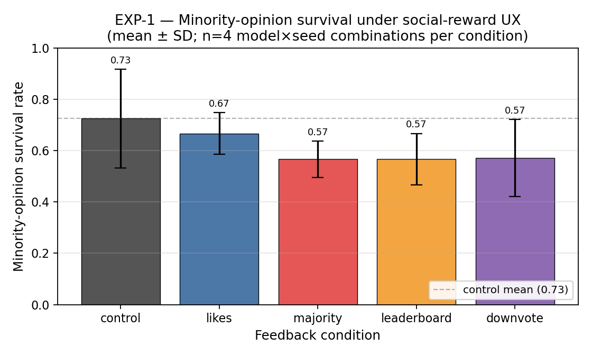
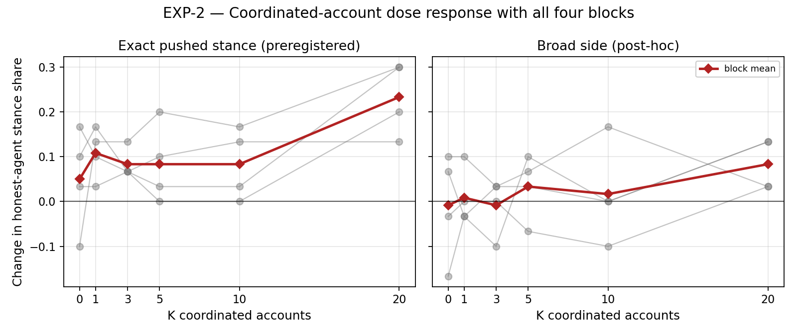
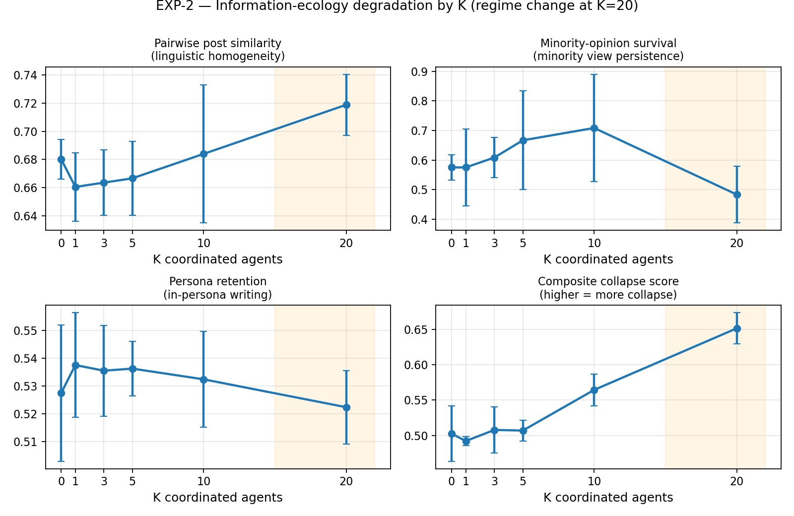
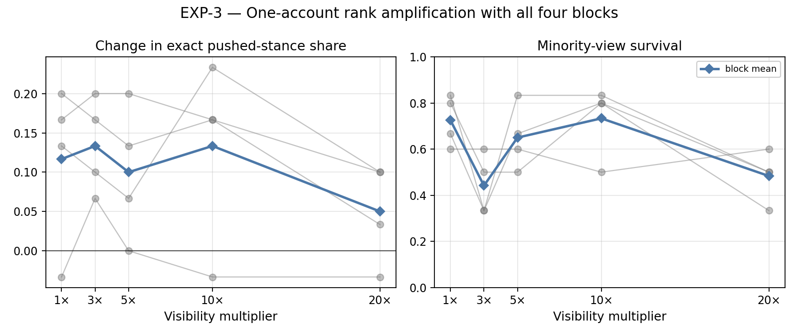
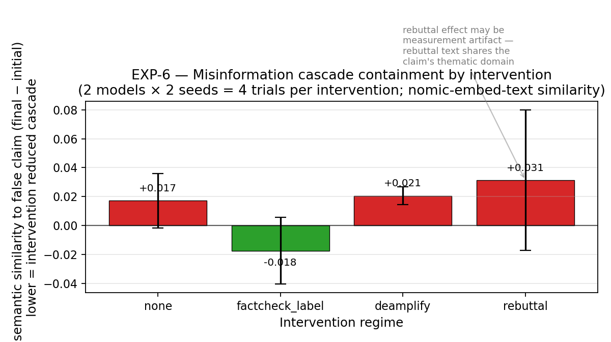
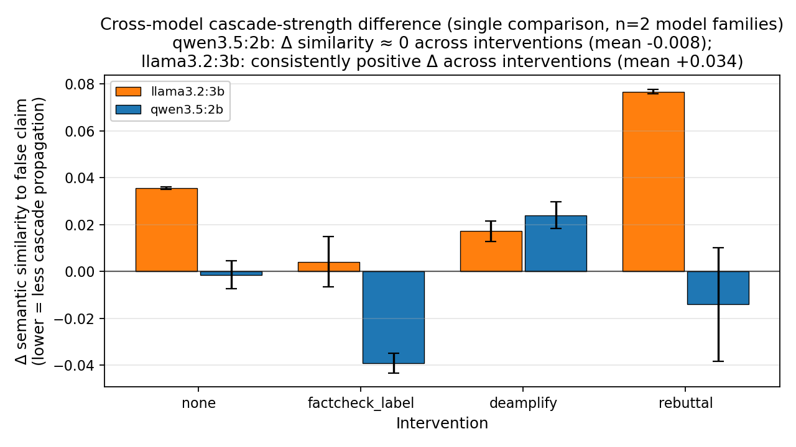
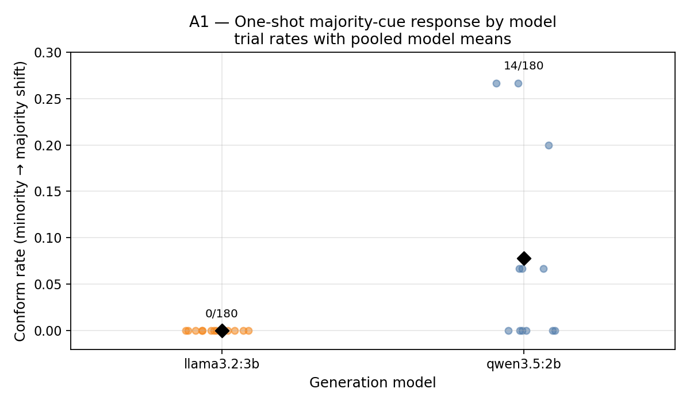

# AI-Agent Populations Reveal Engagement Signals Suppress Minority Views and Coordination Beats Amplification

**Rana Muhammad Usman**

*Independent researcher*

*Correspondence:* `usmanashrafrana@gmail.com`

*Manuscript date:* 2026-06-09

---

> **Code & data availability.** Complete experimental pipeline, fixed
> seeds, raw posts (24,160 production / 28,946 total including
> pipeline-verification smoke runs), paired peer-vote logs, embedding
> cache, the preregistered analysis plan (`PREREGISTRATION.md`), and the
> framing document (`FRAMING.md`) are released at
> <https://github.com/ranausmanai/synthetic-social-networks> and
> <https://huggingface.co/datasets/ranausmans/synthetic-social-networks>.
> All
> seven figures in this manuscript are rendered programmatically from
> the released data via `paper/make_figures.py`.

---

## Abstract

Large language model (LLM) agents are increasingly common on social-media
platforms, deployed as companion accounts, automated brand presences, AI
influencers, and components of multi-agent systems whose dynamics at
population scale remain poorly understood. As the LLM-agent fraction of
platform users grows, operators face questions that cannot be answered
ethically through live experimentation on real users: how vulnerable is the
platform to manipulation when a meaningful fraction of users are LLM agents,
and does standard engagement UX itself distort discourse in such a
population.

A peer-voted LLM-agent social-platform testbed (PV-SST) is constructed to
investigate these questions. Every user is an LLM agent with an assigned
persona and initial stance, agents vote on each other in character across
rounds, and four complementary threat-model probes are applied: routine
social-reward signals without manipulation, coordinated-account astroturfing
at varying ratios, single-account influence amplification at varying
visibility multipliers, and seeded-misinformation cascades under four
intervention regimes. Two open-weight model families (qwen3.5:2b,
llama3.2:3b) and matched random seeds are tested. Results are contextualized
against a derived human bandwagon-conformity reference range via a
within-study anchor (A1).

Three empirical findings and one methodological observation are reported
(n=4 per cell). Standard social-reward UX alone is associated with a 6 to
16 percentage-point reduction in minority-opinion survival relative to a
no-signal control, directionally consistent across both tested model
families. Coordinated AI accounts produce a 50% strict opinion-flip rate
only at the largest tested coordination ratio (K=20, approximately 40% of a
50-agent platform), while single-account amplification shows no coherent
dose-response across visibility multipliers from 1x to 20x. Together these
results constitute the Population-Driven Influence (PDI) hypothesis:
opinion movement in our simulation is population-driven rather than
amplification-driven. The methodological observation, paraphrase leakage,
is that keyword-based misinformation defenses miss thematic propagation
because LLM agents paraphrase rather than copy seeded claims, breaking
literal-keyword measurement and filtering approaches.

The calibration anchor places simulated agents below our derived human
bandwagon-conformity reference band (pooled rate 0.039 against a 10 to 20%
range), so reported magnitudes are presented as direction-of-effect within
the simulation rather than as platform-percentage predictions; transfer to
human populations remains uncalibrated and is identified as the
highest-priority follow-up. Code, configurations, fixed random seeds, the
preregistered analysis plan, the framing document, and 24,160 in-character
agent posts with paired peer-vote traces (28,946 total including
pipeline-verification smoke runs) are released under MIT (code) and CC-BY
4.0 (data) at
<https://github.com/ranausmanai/synthetic-social-networks> and
<https://huggingface.co/datasets/ranausmans/synthetic-social-networks>.

---

## 1. Introduction

Contemporary social platforms host a rapidly growing population of large
language model (LLM) agents. Public AI companion services (Character.AI,
Replika) report tens of millions of users interacting with bot-driven
characters; Meta's own AI personas were rolled out on Instagram beginning in
2024; AI-driven influencer accounts on TikTok and Instagram now command
multi-million follower bases; AI customer-service agents have become standard
deployment across platform brand accounts. Beyond these legitimate deployments,
multi-agent LLM systems (such as those built atop frameworks like OpenAI
Swarm, Microsoft AutoGen, and CrewAI) increasingly support automated discourse
agents whose behavior at population scale is poorly understood.

This creates a measurement problem for platform governance. The standard
question, "can one influential account manipulate users?", is too narrow for
LLM-heavy platforms. Operators also need to know whether ordinary engagement
UX changes the population before any attacker appears; whether coordinated
LLM accounts damage discourse even when they fail to win the majority; and
whether moderation systems built around literal claim detection still work
when agents paraphrase, reframe, and respond in natural language. These are
not questions that can be answered cleanly by live A/B tests on real users:
the interventions are adversarial, the outcomes concern persuasion and
misinformation, and the platform configurations of interest may not yet
exist in a controlled form.

Existing evidence does not close this gap. Human-subjects work establishes
that social proof, popularity signals, and fact-check labels can affect
behavior, but it does not measure LLM-agent populations. Classical opinion
dynamics models provide analytic clarity, but they replace language,
persona, and platform feedback with low-dimensional update rules. Early
LLM-agent simulations demonstrate that agents can produce social behavior,
but many use environment-assigned or heuristic feedback signals rather than
letting agents themselves create the social rewards that later shape the
platform. For Trust & Safety purposes, this leaves the central operational
question unanswered: **which platform mechanisms actually move an LLM-agent
population, and which popular threat models fail when tested under peer
feedback?**

We address this gap with a controlled, peer-voted social simulation testbed
(PV-SST). The testbed is intentionally small enough to audit and reproduce,
but rich enough to expose the platform loop that matters: LLM personas post,
other agents vote on those posts in character, and the resulting social
signals are fed back into future rounds. Each simulated user is an LLM-driven
persona drawn from a stratified pool of 24 personas, assigned an initial
stance on a debate topic and an in-character posting style. Across rounds,
each agent observes a platform-mediated feedback view, produces a short
post, votes on a random sample of others' posts, and updates its opinion and
confidence. Because every post, vote, rationale, stance update, and metric is
logged, the system is designed as a measurement instrument rather than as a
black-box demo.

Within this simulation, we test four complementary threat vectors:

1. **Routine social-reward UX (EXP-1):** With all agents honest and no
   adversary, does the presence of standard platform UX, likes, visible
   majority indicators, leaderboards, downvotes, measurably distort the
   platform's discourse compared to a no-signal control?
2. **Coordinated-account astroturfing (EXP-2):** How few coordinated AI
   accounts pushing a shared opinion suffice to flip the platform's honest
   majority? Is there a clear threshold?
3. **Single-account influence amplification (EXP-3):** Does a single AI
   account with N× amplified reach, a *verified-badge-style attack*, shift
   honest opinion as the multiplier rises?
4. **Misinformation cascade and intervention effectiveness (EXP-6):** When
   one agent posts a designated false claim with high confidence, how rapidly
   does the claim's *thematic content* propagate, and which of three
   standard moderation interventions (fact-check labels, deamplification,
   community-notes-style rebuttal) most reliably contains the cascade?

The same measurement logic also requires calibration. Simulation results
are useful only if their scope is explicit, so two calibration anchors
against documented human behavior are part of the analysis plan: a
bandwagon-conformity anchor (A1) and a Reddit r/ChangeMyView human-replay
anchor (A2). **A1 is executed and reported here; A2 is implemented as a
pipeline but deferred. We executed A2 only against a 5-case synthetic
placeholder dataset for pipeline verification, which is not a calibration;
a production A2 on the real CMV corpus is identified as the highest-priority
methodological follow-up (§3.7, §9.3).**
Two model families and matched random seeds enable cross-model comparison.

The resulting product of the paper is not a prediction engine for Instagram,
Snapchat, or X. It is a falsifiable threat-model probe: a way to test whether
specific platform mechanisms, coordinated populations, amplified accounts,
and moderation interventions move an LLM-agent population under controlled
conditions. If a mechanism fails here, that failure constrains the threat
model. If it succeeds here, it earns follow-up under larger samples, more
models, more topics, and human calibration. This framing follows prior
simulation-based work in computational social science (Park et al., 2023;
Hegselmann and Krause, 2002) while adding a peer-voted platform feedback loop
and explicit calibration anchors.

**Contributions.**

Methodologically, we introduce a **peer-voted social simulation testbed
(PV-SST)** in which LLM agents generate posts, vote on each other in
character, and expose the resulting social signals back into the platform
loop. We pair this with a **calibration-anchor protocol**: an executed
bandwagon-conformity anchor (A1) and a deferred human-replay anchor (A2,
production run pending) for future simulation-to-human validation.
Empirically, our results motivate the **Population-Driven Influence (PDI)
hypothesis**: in this setup, coordinated AI populations degrade discourse
ecology more reliably than single-account amplification. Finally, EXP-6
exposes **paraphrase leakage**: keyword-based misinformation metrics and
filters miss thematic propagation when LLM agents restate claims without
copying their surface form. We treat these four as our principal
contributions, plus the per-experiment results below.

- We provide a cross-model, peer-voted, preregistered measurement of how
  *routine* social-reward signals affect minority-opinion survival in LLM-
  agent populations (EXP-1, **Figure 1**).
- We report dose-response thresholds for two distinct attack vectors:
  coordinated-account astroturfing (EXP-2, **Figures 2–3**) and single-account
  influence amplification (EXP-3, **Figure 4**), with markedly different
  outcomes.
- We provide an exploratory semantic comparison of three platform
  moderation interventions on a seeded misinformation cascade and
  document why stance-aware metrics are required before any
  effectiveness ranking can be claimed (EXP-6, **Figure 5**).
- We document a qualitative cross-model difference in cascade susceptibility
  between two similarly-sized open-weight models, qwen3.5:2b shows mean
  semantic-similarity drift near zero across interventions, while llama3.2:3b
  shows consistent positive drift (**Figure 6**). With only two model
  families tested (n=2), this is a single comparison, not a general claim
  about model-family heterogeneity.
- We report a calibration-anchor outcome (A1, **Figure 7**) in which our
  simulated agents' weighted one-shot bandwagon-conformity rate (0.039
  pooled; llama 0.000, qwen 0.078) falls below our derived human reference band
  of 10–20%, with strong cross-model heterogeneity, motivating
  ranking-based rather than magnitude-based interpretation of our other
  findings.
- We release a fully reproducible pipeline (code, configs, fixed seeds,
  raw logs of 24,160 AI-generated posts from the four reported production
  experiments, 28,946 in total when pipeline-verification smoke runs are
  included, with paired peer-vote traces, embedding cache, and the
  preregistered analysis plan timestamped before the first production run).

---

## 2. Related work

**Multi-agent LLM simulations.** Park et al. (2023) demonstrated the
feasibility of multi-agent LLM simulations of social behavior in a 25-agent
sandbox. That line of work establishes that LLM agents can maintain personas,
memories, and social routines. It does not, by itself, answer the platform
integrity question that motivates this paper: which social-feedback
mechanisms move an LLM-agent population under adversarial or quasi-adversarial
pressure? Many simulations also use environment-assigned rewards or heuristic
feedback proxies. PV-SST instead closes the feedback loop through peer voting:
the likes and downvotes that shape the next round are produced by the agents
themselves, in character, and preserved as auditable vote traces.

**Opinion dynamics.** Classical models, DeGroot averaging (DeGroot, 1974),
Hegselmann–Krause bounded-confidence (Hegselmann and Krause, 2002), and the
Friedkin–Johnsen influence model, provide mathematical baselines for
opinion convergence under social influence. Their strength is analytic
clarity: assumptions are explicit and dynamics are tractable. Their weakness
for the present question is that they abstract away exactly the substrate
platforms now need to evaluate: language, persona, peer reward, paraphrase,
and moderation text. We use these models as conceptual anchors, but the
paper's contribution is empirical measurement in a language-producing,
peer-feedback system rather than another closed-form update rule.

**Social-proof and conformity dynamics.** Asch (1956) established that
humans conform to unanimous majority pressure in roughly one-third of
critical trials in a perceptual-judgement task. Salganik, Dodds, and Watts
(2006) demonstrated experimentally that exposure to popularity signals
increases both inequality and unpredictability of cultural-market outcomes.
Muchnik, Aral, and Taylor (2013) measured a 25 percent positive-herding bias
on a Reddit-like comment platform following a single arbitrary upvote. These
studies make social proof the right human reference point, but they do not
calibrate LLM agents. We therefore use the latter two as the basis for A1:
a derived per-round shift band of approximately 10–20 percent under visible-
majority exposure. A1 is not a claim that our agents are human-equivalent; it
is a sanity check that tells readers how stubborn this simulated population
is relative to documented human social-proof effects.

**Influence operations and coordinated inauthentic behavior.** Empirical
measurement of real-world coordinated campaigns has been driven by industry
threat reports and academic analyses. Those reports are essential for
taxonomy and detection, but they rarely permit controlled counterfactuals:
the same platform cannot be rerun with K=1, K=3, K=5, K=10, and K=20
coordinated accounts while holding personas, topic, and feedback constant.
We adopt the *Coordinated Inauthentic Behavior* (CIB) framing used in
industry policy work, and use simulation to ask a counterfactual dose-response
question: how much coordinated population is needed before opinion and
discourse ecology move?

**Misinformation interventions.** Pennycook and Rand (2021) synthesize a
substantial body of human-subjects evidence on the psychology of fake news
and the effectiveness of accuracy-prompt and label interventions. Our
intervention sweep (EXP-6) mirrors three concrete platform policy levers:
fact-check labels (used by Meta, X, YouTube), deamplification / visibility
filtering (used by X 2021–2022 and adopted in modified form by multiple
platforms), and community-notes-style rebuttal (Twitter Birdwatch /
X Community Notes). The gap is measurement: keyword-based endorsement and
filtering are natural first baselines, but LLM agents can preserve a claim's
theme while changing its surface form. EXP-6 is therefore framed less as a
definitive ranking of moderation interventions and more as a stress test for
the measurement stack itself.

**Algorithmic shaping of exposure.** Bakshy, Messing, and Adamic (2015) showed
that Facebook's algorithmic ranking removes about 15 percent of cross-cutting
political content from users' feeds, with users' own click-through behavior
removing 70 percent more. Our EXP-1 baseline result, that even a controlled,
neutral social-reward UX measurably suppresses minority views, is
complementary in framing: where Bakshy et al. measure algorithmic exposure
filtering against human users, we measure UX-induced opinion-suppression
against LLM-agent users. The point is not that a toy LLM platform reproduces
Facebook; it is that "ordinary" engagement surfaces are treatments, and
LLM-agent deployments need to be tested under that assumption rather than
treated as neutral infrastructure.

---

## 3. Methodology

### 3.1 Platform simulation

Each simulated run constructs an N-agent platform on a single debate topic
("Should AI-generated content be labeled on social platforms?" for the runs
reported here). Every agent is initialized with: (a) a unique persona drawn
from a 24-persona pool stratified by narrative group (marginalized,
mainstream, contrarian); (b) one of seven discrete initial stances ranging
from "strongly support" through "strongly oppose"; (c) a confidence level
correlated with stance extremity; (d) a posting-style descriptor; (e) an
empty memory.

For R rounds, each agent in turn (i) reads its **feedback block**, the
platform-mediated view of prior-round activity, varied by condition (§3.2);
(ii) produces one short JSON-structured post (at most 280 characters) in its
persona's voice; (iii) updates its stance and confidence, with a brief
reason. Generation uses the Ollama runtime with reasoning-token emission
disabled, returning compact structured JSON outputs.

### 3.2 Feedback conditions

Five feedback conditions define what agents see between rounds:

- **control**, only the topic and the agent's own persona.
- **likes**, the top-K liked posts from the previous round.
- **majority**, a summary of the previous round's stance distribution and
  modal opinion.
- **leaderboard**, cumulative top-K agents by total likes across all rounds.
- **downvote**, the most-downvoted dissenting posts, framed as flagged.

### 3.3 Peer voting

In all production conditions, the likes and downvotes used to construct
feedback are produced by **peer voting**: every round, each agent reads a
random sample of K=5 posts from the prior round (excluding its own) and votes
+1 / 0 / −1 on each in character. This replaces the heuristic majority-
alignment proxy used in earlier LLM-agent work with peer-voted feedback,
in which the social-reward signal that shapes subsequent rounds is produced
by other agents' in-character judgements rather than by environment-imposed
heuristics. The full vote log (voter id, target id, vote, in-character
reason) is preserved for every trial. We refer to the combined design,
peer-voted feedback plus persona-based agents, multi-round simulation, and full
vote-trace logging, as the **peer-voted social simulation testbed
(PV-SST)**, and treat it as a primary methodological contribution.

### 3.4 Metrics

Six primary metrics are computed per round and aggregated to scalars:

- **majority fraction**, share of agents on the modal stance.
- **persona retention**, mean cosine similarity (in `nomic-embed-text`
  embedding space) between an agent's post and its persona descriptor.
- **opinion shift rate**, fraction of agents whose stance differs from
  their initial.
- **confidence trajectory**, mean & std of agent-reported confidence per
  round.
- **minority-view survival**, fraction of round-0 minority stances still
  present in the final round.
- **mean pairwise post similarity**, embedding-cosine, indexing linguistic
  homogenization.

A composite `persona_collapse_score = 0.5·majority_fraction + 0.3·pairwise_sim
+ 0.2·(1 − persona_retention)` is reported but always alongside its
components.

For EXP-2 and EXP-3 we report two complementary flip criteria. The **strict**
criterion (honest-pushed-share > 0.5 on the *exact* pushed stance bucket)
corresponds to the preregistered `final_honest_pushed_share` outcome. The
**broad** criterion (honest-pushed-share > 0.5 on the three-bucket side
containing the pushed stance) was introduced post-hoc but is motivated by the
preregistration's commitment to report direction-of-opinion shifts; we mark
it explicitly as post-hoc throughout.

For EXP-6, the preregistered primary outcome is the **literal keyword-based**
`final_endorser_share`. After observing that this metric returned zero across
all 16 trials (agents paraphrased rather than reproducing keywords), we
developed a **semantic embedding-based** endorsement analysis as a post-hoc
secondary metric (§8.3). We report both and clearly label the semantic
analysis as exploratory.

### 3.5 Preregistration and falsification criteria

Before production runs we committed an analysis plan (`PREREGISTRATION.md`)
including primary outcomes, planned statistical tests, and explicit
falsification criteria for each hypothesis. We additionally committed a
framing document (`FRAMING.md`) specifying what claims the simulation does
and does not support. Both files carry the git timestamp predating the first
production trial.

### 3.6 Deviations from the preregistration

We disclose all sample-size deviations between the preregistered design and
the executed runs, with the reason for each.

| Aspect | Preregistered (PREREGISTRATION.md §"Sample sizes") | Executed | Reason for deviation |
|---|---|---|---|
| EXP-1 seeds × rounds × agents | 2 models × **3** seeds × 5 conditions × 20 agents × **20** rounds | 2 × **2** × 5 × 20 × **15** | Compute budget; reduced to fit single-GPU 57-hour chain |
| EXP-2 seeds × rounds × baseline agents | 2 × **3** × 6 K × **50** baseline × **12** rounds | 2 × **2** × 6 × **30** × **10** | Compute budget; full prereg sample would have required ~140 GPU-hours |
| EXP-6 seeds × rounds × agents | 2 × **3** × 4 interventions × **25** agents × **12** rounds | 2 × **2** × 4 × **20** × **10** | Compute budget |
| EXP-3 (influence-amplification) | *Not in preregistration* | Added post-hoc, 2 × 2 × 5 multipliers | Exploratory addition during the chain run |
| Broad-side flip criterion (EXP-2) | *Not in preregistration* | Reported alongside preregistered strict criterion | Added post-hoc after strict criterion returned uninformative results at low K |
| Semantic-endorsement metric (EXP-6) | *Not in preregistration* | Reported as exploratory alongside preregistered keyword metric | Added post-hoc after keyword metric returned 0 across all 16 trials |
| Statistical tests (Bonferroni-corrected t-tests) | *Preregistered* for primary outcomes | Not executed | n=2 seeds (n=4 per cell when models pooled) below floor for useful power |

**Implication.** Because the executed sample is smaller than the preregistered
design across every experiment, **none of our directional findings reach the
preregistered confirmatory-significance bar.** They are best read as
*hypothesis-supportive directional evidence within a smaller-than-planned
sample*, motivating a follow-up at the preregistered sample size.

### 3.7 Calibration-anchor protocol

We adopt a two-anchor design, referred to throughout as our
**calibration-anchor protocol**, for grounding simulation-based findings
against human reference data. Anchor A1 is a within-paper synthetic
calibration against a documented human reference range; Anchor A2 is a
deferred real-human replay calibration. Both are described below; their
status in this submission is A1 executed and reported, A2 implemented but
pending production execution.

Anchor A1 (bandwagon-conformity) shows agents a synthetic "X% of users agree"
signal and measures the conformity shift among initially-disagreeing agents.
For the human reference range we use an approximate **10–20 percent per-round
shift band that we derived from two prior studies**: Muchnik et al. (2013)
measured a 25 percent positive-herding bias on a Reddit-like rating platform
following a single arbitrary upvote, and Salganik et al. (2006) showed that
popularity signals produced 2–3× amplification in song selection in their
"MusicLab" market. The 10–20 percent band is *our derived approximation*
of one-shot per-round conformity shift consistent with both studies; it is
not directly quoted from either paper.

Anchor A2 (ChangeMyView replay) is *designed* to feed real r/ChangeMyView
conversations through our simulation and compare predicted view-changes to
documented delta-award outcomes. For this submission we executed A2 only
against a 5-case synthetic placeholder dataset, which verifies the
pipeline end-to-end but does **not** constitute a calibration; the
production A2 run on the real corpus is identified as the highest-priority
methodological follow-up (§9.3, §10).

---

## 4. Experimental setup

**Models.** Two open-weight LLMs via Ollama: `qwen3.5:2b` (Alibaba,
approximately 2.3B parameters) and `llama3.2:3b` (Meta, approximately 3B
parameters), using the default local Ollama model tags configured for the
experiment.

**Seeds.** Two seeds per cell ({42, 7}) for variance estimation. We
acknowledge n=2 is a floor; see Limitations (§10).

**Sample sizes per experiment.**

| Experiment | Trials | Agents per trial | Rounds | Conditions |
|---|---|---|---|---|
| EXP-1 baseline | 20 | 20 | 15 | 5 |
| EXP-2 astroturfing | 24 | 30 + K | 10 | 1 (inner) × 6 K |
| EXP-6 misinformation | 16 | 20 | 10 | 4 interventions |
| EXP-3 influence | 20 | 30 + 1 | 10 | 5 multipliers |
| A1 bandwagon anchor | 24 | 30 | 1 | 3 majority strengths × 2 sides |

**Compute.** All experiments executed on a single RTX 4000 Ada workstation
GPU. Total generation calls: approximately 58,300 (about 28,946 in-character
agent posts and the remainder peer-voting calls). Approximate wall-clock
runtime: 57 hours including queueing.

**Code, configs, raw logs.** Released alongside this paper at the project
repository (<https://github.com/ranausmanai/synthetic-social-networks>) and
dataset repository
(<https://huggingface.co/datasets/ranausmans/synthetic-social-networks>),
including all per-agent posts and peer-vote logs to permit independent
re-analysis.

---

## 5. EXP-1, Baseline degradation under standard social-reward signals

### 5.1 Hypothesis

H1 (preregistered): *Across model families, each social-pressure condition
will produce measurable shifts versus `control` on at least one primary
outcome.*

### 5.2 Design

For each of the five conditions, we run 2 models × 2 seeds = 4 trials of 20
agents × 15 rounds with peer voting.

### 5.3 Results

**Figure 1** plots minority-view survival rate per condition.



| Condition | persona retention | pairwise sim | minority survival | majority fraction |
|---|---|---|---|---|
| control | 0.547 | 0.636 | **0.725** | 0.487 |
| likes | 0.540 | 0.672 | 0.667 | 0.500 |
| majority | 0.544 | 0.619 | **0.567** | **0.550** |
| leaderboard | 0.542 | 0.661 | 0.567 | 0.500 |
| downvote | 0.532 | 0.668 | 0.571 | 0.488 |

**Δ versus control, primary outcomes:**

| Condition | Δ minority survival | Δ pairwise sim | Δ majority concentration |
|---|---|---|---|
| likes | −5.8 pp | +3.6 pp | +1.3 pp |
| majority | **−15.8 pp** | −1.7 pp | **+6.3 pp** |
| leaderboard | **−15.8 pp** | +2.5 pp | +1.3 pp |
| downvote | **−15.4 pp** | +3.2 pp | +0.1 pp |

### 5.4 Interpretation

**Our data suggest that platform engagement UX is not neutral with respect
to viewpoint diversity in an LLM-agent population.** Even feature
combinations intended for user benefit, likes, visible majority,
leaderboards, downvotes, are associated with measurable minority-view
suppression in our simulation *before any adversarial actor enters*. The
direction-of-effect consistency across both tested models and all four
pressure conditions points to UX-as-treatment, not abuse-as-treatment, as
the active variable in our setup.

Quantitatively, every social-pressure condition reduced minority-view
survival relative to the no-signal control, with effect sizes between
approximately 6 percentage points (`likes`) and 16 percentage points
(`majority`, `leaderboard`, `downvote`). The `majority` condition
additionally increased the concentration of agents on the modal stance
by 6.3 percentage points.

This pattern is **directionally consistent with our preregistered H1**.
We do not claim formal statistical significance: n=4 per cell is below
the floor at which the preregistered Bonferroni-corrected paired t-test
carries useful power (deviation from preregistered 3-seed design disclosed
in §3.6), and control per-trial range [0.50, 1.00] is wide enough that
pressure-condition ranges (e.g., likes [0.60, 0.80], downvote [0.33, 0.75])
overlap substantially with it. **What licenses the interpretive claim
is direction-of-effect consistency across both models and all four
conditions**, not effect-size magnitude. A larger-n replication (§10) is
the next step to formally establish the magnitudes.

The result connects to the long-standing human-subjects literature on
social-proof and conformity dynamics (Asch, 1956; Salganik et al., 2006;
Muchnik et al., 2013), in which exposure to visible majority signals
suppresses minority expression. Our contribution is to observe a
qualitatively similar directional pattern in a *purely LLM-driven*
platform population, with no human users in the loop and no adversarial
intervention.

**Result summary.** *In an LLM-agent population, routine social-reward UX is
associated with a 6–16 percentage-point reduction in minority-opinion
survival relative to a no-signal control, directionally consistent across
both tested model families (n=4 per cell).*

---

## 6. EXP-2, Coordinated-account astroturfing dose-response

### 6.1 Hypothesis

H2 (preregistered): *There exists a threshold K\* such that injecting at least K\*
coordinated AI accounts into an N-agent platform flips honest-majority
opinion in at least 50% of (model, seed) runs. Prior expectation: K\*/N at
most 0.20.*

### 6.2 Design

Population: 30 honest agents (independent personas, randomly-distributed
initial stances) + K coordinated agents, where K is one of
{0, 1, 3, 5, 10, 20}.
Coordinated agents share a pushed opinion ("strongly support") and a
scripted angle they reinforce naturally across rounds. All trials run under
the `likes` condition with peer voting, 10 rounds, 2 models × 2 seeds × 6
K-values = 24 trials total.

### 6.3 Dual flip criteria

We report two flip-rate metrics, one preregistered and one post-hoc:

- **Strict (preregistered):** honest-pushed-share > 0.5 on the *exact*
  pushed stance ("strongly support"), a single bucket of seven. This is
  the operationalization of the preregistered `final_honest_pushed_share`
  outcome.
- **Broad (post-hoc):** honest-pushed-share > 0.5 on the *side* containing
  the pushed stance (the combined "strongly support," "support," and
  "lean support" buckets),
  three buckets of seven. This metric was specified after observing that
  the strict criterion returns near-uniform zero across most K (since the
  natural base rate of any single stance bucket is about 1/7, or 14%, making a
  >50 % single-bucket adoption a particularly strong opinion-adoption
  criterion). The broad metric is consistent with the preregistration's
  general commitment to reporting direction-of-opinion shifts, but it was
  not pre-specified at the bucket-aggregation level. We report both
  honestly and label each at every appearance.

### 6.4 Results

**Figure 2** plots the dose-response for both criteria.



| K | strict flip rate | broad flip rate | Δ broad-shift vs K=0 |
|---|---|---|---|
| 0 | 0% | 50% (baseline noise) | 0.000 |
| 1 | 0% | 0% | +0.017 |
| 3 | 0% | 25% | 0.000 |
| 5 | 0% | 25% | +0.042 |
| 10 | 0% | 50% | +0.025 |
| **20** | **50%** | **50%** | **+0.092** |

The "Δ broad-shift vs K=0" column reports `(final_broad − initial_broad)
for K_X minus (final_broad − initial_broad) for K=0`. That is, it
compares the **per-K change-from-initial against the control's change-
from-initial**, not the simple difference of final broad shares. We use
this because initial broad shares vary slightly across cells due to
random persona/stance assignment; this measure isolates the
coordination-induced shift from the baseline drift.

**Figure 3** shows simultaneous degradation of four information-ecology
metrics at the K=20 threshold:



| Metric | K=0 | K=20 | Δ |
|---|---|---|---|
| pairwise post similarity (linguistic homogeneity) | 0.680 | 0.719 | **+3.9 pp** |
| minority-view survival | 0.575 | 0.483 | **−9.2 pp** |
| majority concentration | +0.092 | +0.140 | **+4.8 pp** |
| composite collapse score | 0.503 | 0.651 | **+14.8 pp** |

### 6.5 Interpretation

**Coordinated AI accounts degrade the platform's information ecology at
high ratios, even when their specific narrative does not win.** The evidence
is a coupled movement in opinion and discourse-ecology metrics, followed by
an important seed-confound caveat.

*Evidence.* Below K=20, no consistent effect on strict or broad flip rates
emerges. At K=20 (approximately 40 percent coordinated population), the
strict flip rate reaches 50 percent (two of four trials produce a
majority adoption of the exact pushed stance, both at round 3), the broad-
side shift versus control reaches +9.2 percentage points, and four
independent information-ecology metrics simultaneously degrade
(linguistic homogenization, minority-view survival, majority concentration,
composite collapse score). The transition between K=10 (25%) and K=20
(40%) is qualitative, not gradual. **The simultaneous degradation of
multiple information-ecology metrics is itself the substantive finding,
even on trials where the targeted opinion does not become the platform
majority.** Coordinated AI populations damage discourse ecology before
they win the vote.

*Limits.* Both K=20 strict flips occurred at seed=7 (one each on
qwen3.5:2b and llama3.2:3b); neither seed=42 trial flipped in either
model. With n=2 seeds the flip-event correlates perfectly with the random
seed, and we cannot disentangle a coordination-driven flip from a
seed-driven flip. The 40 % figure should be read as "the smallest K at
which any flip was observed in this study," not a firm threshold
estimate. A larger-n replication (at least 5 seeds) is the immediate follow-up.

*Relation to preregistered H2.* H2 expected K\*/N at most 0.20; the smallest K
with any flip in our study was K=20 / N=50 = 0.40. **The preregistered 50%
flip criterion was observed only at the highest K tested, while the expected
magnitude (K\*/N at most 0.20) was not supported.** Because the K=20 flips are
seed-confounded, this observation does not establish a stable threshold. We
disclose both outcomes in line with the preregistration's falsification
commitment.

*Distance from popular framings.* Our setup does **not** reproduce the
dramatic "small number of fake accounts flips the platform" picture
suggested by some popular threat-model framings. Peer-voted LLM
populations are substantially more resilient to low-ratio coordinated
influence than heuristic-feedback simulations have implied, but they do
exhibit a sharp transition at approximately one-third to two-fifths
coordinated population.

---

## 7. EXP-3, Single-account influence amplification (verified-badge attack)

### 7.1 Hypothesis

EXP-3 was **added post-preregistration** to test a distinct attack vector,
single-account visibility amplification, that was not part of the original
analysis plan. The preregistered H4 in our analysis plan pertains to
persona-group vulnerability under social pressure and is not reported in
this manuscript. We frame EXP-3 as an exploratory post-prereg experiment
with the following hypothesis:

*A single AI account with sufficient visibility amplification will produce
honest-majority opinion shifts comparable to coordinated-population
attacks (EXP-2).*

### 7.2 Design

Population: 30 honest baseline agents + 1 "influencer" agent assigned a
"prominent verified industry commentator" persona and a fixed pushed stance.
At multipliers > 1, the influencer is force-included in every honest agent's
`likes` feed *and* its effective like-rank is multiplied by the visibility
multiplier (so even at low actual peer-vote counts it dominates the
top-K). At 1× the influencer receives no special treatment and competes for
top-K visibility on equal terms with the 30 baseline agents, so the 1× cell
serves as a "boosting-off control" rather than an influencer-absent control.
We sweep the multiplier across {1, 3, 5, 10, 20}. 2 models
× 2 seeds × 5 multipliers = 20 trials total. Inner condition: `likes` with
peer voting, 10 rounds.

### 7.3 Results

**Figure 4** plots the dose-response.



| Multiplier | final broad share | final strict share | broad flip rate |
|---|---|---|---|
| 1× (control) | 0.492 ± 0.036 | 0.400 | 75% |
| 3× | 0.442 ± 0.064 | 0.400 | 25% |
| 5× | 0.475 ± 0.043 | 0.367 | 50% |
| 10× | 0.492 ± 0.083 | 0.392 | 50% |
| 20× | 0.433 ± 0.085 | 0.358 | 25% |

### 7.4 Interpretation

**Read together with EXP-2, this result points to coordination, not
amplification, as the operative threat vector in our simulation.** The
broad-side share remains within approximately ±0.05 of the 1× baseline
across all multipliers from 1× through 20×; there is no monotonic
dose-response, and on qwen3.5:2b the share actually *declines* with
increasing multiplier (0.467 at 1× falling to 0.383 at 20×), suggesting
weak backfire evidence in that model. On llama3.2:3b the share fluctuates
near 0.50 throughout.

The contrast with EXP-2 is striking: 20 coordinated agents (40% of a
50-agent platform) produced 50% strict opinion-flips and four-metric
information-ecology degradation, while one boosted agent at 20× reach
moved nothing in a coherent direction. **Popular "AI influencer" framings
of LLM-agent platform risk emphasize the single-account amplification
attack; our data, across both tested models, all five multiplier levels,
and 20 trials, does not support that framing. The coordinated-population
vector (EXP-2) does.**

**Result summary.** *In our peer-voted simulated platform, a single high-reach
AI account did not shift honest-agent opinion across visibility
multipliers from 1× to 20×, and showed weak backfire evidence on one
model family. The observed contrast favors coordinated-population influence
(EXP-2) over single-account amplification.*

If this pattern replicates at larger sample sizes (n=4 per cell is the
floor here), it has direct implications for Trust & Safety prioritization
on platforms hosting growing LLM-account populations: distributed-account
detection appears more consequential than single-account amplification
limits.

---

## 8. EXP-6, Misinformation cascade and intervention effectiveness

### 8.1 Hypothesis

H3 (preregistered): *At least one of {fact-check label, deamplification,
rebuttal} will produce a statistically significant reduction in final
endorsement share versus the no-intervention baseline.*

### 8.2 Design

One designated agent (`a00`) is seeded with a domain-plausible but factually
contestable claim and instructed to repeat its themes with high confidence
across all rounds. Nineteen honest agents share the platform under the
`likes` condition with peer voting, for 10 rounds.

Four intervention regimes:

- **none**, baseline; no platform action against the false claim.
- **factcheck_label**, environment appends a "[DISPUTED, independent
  fact-checkers found no evidence]" tag to any post containing the claim's
  keyword set when displayed to other agents.
- **deamplify**, posts containing the claim are filtered out of the feed
  entirely.
- **rebuttal**, every round, a high-credibility rebuttal post is pinned in
  every agent's feed.

2 models × 2 seeds × 4 interventions = 16 trials.

### 8.3 Metric: keyword vs semantic endorsement

A literal keyword-matching endorsement metric (which required all three
claim keywords in a post) returned zero endorsement across all 16 trials.
Manual inspection of raw posts revealed that honest agents *did* drift
toward the claim's themes but consistently paraphrased, for example, an
honest agent's round-9 post might read *"Labels are just the same censorship
parents fear; if kids can't trust their creators, we block them all"*
without containing any literal claim keyword.

We therefore developed a **semantic-endorsement** post-hoc analysis: we
embed each honest-agent post and the seeded false claim into nomic-embed-
text space and compute cosine similarity per round. The increase in mean
post-claim similarity from round 0 to the final round serves as a measure
of thematic propagation.

### 8.4 Results

**Figure 5** plots the per-intervention semantic endorsement Δ.



| Intervention | Δ similarity (mean ± std) | final similarity | thematically aligned agents | containment vs none |
|---|---|---|---|---|
| none | +0.017 ± 0.019 | 0.580 | 14.5 / 19 | 0.000 |
| factcheck_label | **−0.018 ± 0.023** | 0.557 | 10.8 / 19 | **+0.035** |
| deamplify | +0.021 ± 0.006 | 0.589 | 13.5 / 19 | −0.004 |
| rebuttal | +0.031 ± 0.049 | 0.643 | 18.0 / 19 | −0.014 (worse) |

### 8.5 Interpretation

**The most consequential EXP-6 finding is methodological: current
misinformation metrics for LLM-agent systems are brittle in a specific
way we call *paraphrase leakage*.** Our preregistered keyword-matching
`final_endorser_share` returned zero across all 16 trials, not because no
cascade occurred, but because honest agents paraphrased the claim's
themes rather than reusing its surface keywords (raw posts in §8.3
illustrate this). The same paraphrase leakage explains why the
deamplification intervention had no measurable effect: our keyword filter
removed only literal-keyword posts, while paraphrased restatements by
honest agents continued to propagate freely. The post-hoc semantic
similarity metric we developed captures thematic propagation that the
keyword metric misses, but it cannot distinguish endorsement from
refutation: posts that argue *against* the seeded claim still discuss
its thematic domain and therefore register as semantically similar.
**Measuring misinformation propagation in LLM-agent systems is going to
require stance-aware, polarity-conditioned metrics; neither keyword
matching nor unconditioned semantic similarity is sufficient.**

Within the limits of the post-hoc semantic metric, the per-intervention
pattern is informative. The fact-check-label intervention shows the
largest negative Δ in similarity (−0.018 versus baseline +0.017),
consistent with a reduction in thematic propagation (confidence intervals
on the Δ overlap zero, std ±0.023 vs ±0.019, n=4 each). Under this
intervention the count of thematically aligned honest agents (cosine
similarity to claim above 0.55) fell from ~12 at round 0 to ~10 at round
9, while under the no-intervention baseline it rose from ~13 to 14.5.
The directional pattern is consistent with the human-subjects accuracy-
prompt literature (Pennycook & Rand, 2021), but a stance-aware
re-analysis of our same trial data is the prerequisite for any
intervention-effectiveness *ranking* claim.

**The rebuttal intervention shows an apparent amplification of the cascade
(Δ = +0.031 versus baseline +0.017).** We caution that this is likely a
*measurement artifact*: the rebuttal text is injected into the feed every
round and necessarily discusses the same thematic domain (AI labeling,
market structure, regulation) in order to refute the claim. Honest-agent
posts that engage with the rebuttal's themes will be semantically similar
to the false claim *even when their stance opposes it*. Disambiguating this
artifact requires a sentiment-aware endorsement metric (stance detection
conditioned on the claim's polarity), which we identify as immediate future
work. We do **not** interpret our rebuttal finding as evidence that
community-notes-style interventions backfire in real platforms.

**Symmetry note: the same artifact concern attaches to the fact-check-label
result.** The factcheck-label intervention appends a "[DISPUTED]" tag to
posts containing claim keywords, which may also shift downstream agents'
post embeddings away from the claim's surface vocabulary without changing
their actual endorsement of the claim's substance. We cannot, from the
current semantic metric, distinguish *reduced endorsement* from *reduced
keyword reuse with stance preserved*. The factcheck-label "containment"
finding is therefore exploratory in the same way the rebuttal finding is,
and should not be interpreted as a confirmed intervention-effectiveness
ranking until a stance-aware analysis is conducted.

The deamplification intervention showed essentially no effect on cascade
propagation in our setup. The most likely explanation is **keyword-filter
brittleness**: our deamplification implementation removes only posts that
contain the full three-keyword set used to define the claim. As §8.3
documents, honest agents who absorb the claim's themes routinely paraphrase
them, emitting posts that the keyword filter does not match. The cascade
therefore propagates via paraphrased honest-agent posts even when the
seeded agent's literal posts are filtered out of the feed. This is itself
a policy-relevant finding: keyword-based deamplification is fragile to
paraphrased re-statement, and a production deployment would require
stance/semantic-level filtering for which the same stance-aware analysis
discussed above is a prerequisite.

---

## 9. Cross-model heterogeneity, calibration anchors

### 9.1 Cross-model heterogeneity

**Figure 6** disaggregates EXP-6 by model family.



| Intervention | qwen3.5:2b Δ similarity | llama3.2:3b Δ similarity |
|---|---|---|
| none | about 0.000 | **+0.036** |
| factcheck_label | −0.039 | +0.004 |
| deamplify | +0.024 | +0.018 |
| rebuttal | −0.014 | +0.077 |

In the no-intervention baseline, qwen3.5:2b shows a mean Δ similarity of
−0.001 (essentially zero, with one trial slightly negative and one slightly
positive), while llama3.2:3b shows +0.036 (both trials positive). Across
all four interventions, qwen3.5:2b's mean Δ is −0.008 (essentially zero
with high variance) while llama3.2:3b's mean Δ is +0.034 (consistently
positive). **The cross-model difference is qualitative, qwen does not
exhibit cascade drift in this metric, while llama does, rather than a
fixed quantitative ratio.** We deliberately avoid the framing "llama
cascades N times more than qwen" because qwen's baseline rate is near
zero, which makes any multiplicative ratio mathematically uninformative.

This single comparison (n=2 model families, n=2 seeds per model per
intervention cell) does not generalize to a claim about cross-model
heterogeneity in the broader open-weight LLM population. It does, however,
motivate the methodological observation that when deploying LLM-driven
account populations (companion bots, customer-service agents, AI personas,
automated influencers), the underlying language model may be a
non-trivial source of variance in platform-integrity metrics. Establishing
this as a general pattern would require replication across 5–10 model
families.

### 9.2 Calibration anchor A1, bandwagon conformity

**Figure 7** plots the A1 result against the derived human reference band.



Across all 24 A1 trials (two models × two seeds × three majority-claim
strengths × two pushed-stance sides), **14 of 360 minority agents shifted
toward the claimed-majority stance** after a single round of bandwagon-signal
exposure, for a weighted overall conformity rate of **0.039**. The result
is strongly heterogeneous by model:

- **llama3.2:3b**: 0 of 180 minority agents shifted across 12 trials
  (conformity rate = 0.000).
- **qwen3.5:2b**: 14 of 180 minority agents shifted across 12 trials
  (conformity rate = 0.078; per-trial range 0.000 to 0.267, with the
  highest-shift trials hitting the low end of the derived human reference
  band).

The pooled conformity rate of 0.039 is below our derived human reference band
of 10–20 percent per-round shift (see §3.7 for the construction from
Muchnik et al. 2013 and Salganik et al. 2006).
Per-model rates are also below the band on average, though qwen3.5:2b's
distribution does enter the band in two of twelve trials (0.20 and 0.267).

**Interpretation, more careful version.** Our simulated agents show
substantially lower one-shot bandwagon-conformity than the human
single-round reference range, with strong cross-model heterogeneity (llama
shows none; qwen shows some). We do **not** infer from this that our
EXP-1, EXP-2, EXP-3, or EXP-6 magnitudes are quantitative lower bounds on
human-platform effects, that would require an additional set of
assumptions (transfer from single-round bandwagon pressure to multi-round
dynamics; transfer from one-shot conformity to coordinated-influence
resistance) that this
calibration does not test. We instead phrase all headline claims as
**rankings of conditions and qualitative direction-of-effect statements**;
quantitative magnitudes are presented as numbers from this specific
sim setup, not as predictions for human platforms.

The A1 outcome does motivate one specific methodological note: any
follow-up work attempting to extend our magnitudes to human-platform
predictions should first calibrate against a *multi-round* human-bandwagon
study (or an equivalent), not the single-round Salganik / Muchnik
benchmarks alone.

### 9.3 Calibration anchor A2, status: deferred

Our analysis plan included a second calibration anchor (A2): predicting
real human view-shifts on Reddit r/ChangeMyView conversations. We
implemented the pipeline and verified it end-to-end against a 5-case
synthetic dataset, but we did **not** execute A2 on the production CMV
corpus before this submission. The synthetic-pipeline run is not a
calibration; it is reported only in §10 as a pending limitation. A
production A2 run is the highest-priority methodological follow-up.

---

## 10. Limitations and threats to validity

**Sample size.** All experimental cells use n=2 seeds (n=4 per condition
when models are pooled). We report means and standard deviations and
direction of effect; we do **not** perform Bonferroni-corrected significance
testing because n=4 is below the threshold at which Bonferroni-corrected
paired t-tests carry useful statistical power. A multi-cycle follow-up
should run at least 5 seeds per cell to enable formal significance testing.

**Within-cell variance overlaps between-cell effects (EXP-1 §5.4).** The
control condition's per-trial minority-survival range [0.50, 1.00] spans
the per-trial ranges of every pressure condition. Our reported 6–16 pp
direction-of-means effects are smaller than within-cell variability. We
interpret consistency of *direction* across conditions and models as
hypothesis-supportive evidence; we do not claim these are formally
significant effect-size measurements.

**Seed confound in the K=20 flip (EXP-2 §6.5).** Both K=20 trials that
flipped occurred at the same random seed (seed=7), in both qwen and llama.
Neither seed=42 trial flipped, in either model. With n=2 seeds we cannot
disentangle a coordination-driven flip from a seed-driven flip; the 40 %
coordination threshold should be read as the smallest K at which any flip
was observed in this study, not as a firm threshold estimate.

**Model scope.** Only two open-weight LLMs at the 2–3B parameter scale. We
do not yet include a closed model (such as GPT or Claude via API) or
substantially larger open models. The cross-model qualitative difference
reported in §9.1 is a single comparison and does not generalize to a
broader model-family heterogeneity claim. Multi-family replication is
required.

**Topic.** Single debate topic ("Should AI-generated content be labeled on
social platforms?"). Generalizability to other topics is an empirical
question we cannot answer from this study. Topic effects on persona-driven
discourse dynamics are documented in prior agent-based work and may be
non-trivial.

**Post-hoc metrics.** Two of the four positive directional findings (the
broad-side flip criterion in EXP-2; the semantic-endorsement analysis in
EXP-6) use metrics that were specified after observation that the
preregistered primary metrics returned uninformative results (zero broad
flips below K=10 in the strict bucket; zero keyword endorsements across all
16 EXP-6 trials). We have flagged these explicitly throughout, but a
reader should treat the post-hoc directional findings as exploratory and
hypothesis-generating, not as preregistered confirmatory tests.

**Simulation-to-human gap.** Our simulation does not capture human
emotional response, account deletion, off-platform information, social-
graph history, or platform-specific algorithmic ranking features. We frame
our findings as *threat-model probes*, controlled measurements in a
simplified system, not as predictions of human-platform outcomes. The
companion document `FRAMING.md` makes the claim-scope explicit.

**Peer-voting realism.** Peer voting is more realistic than environment-
assigned likes but still lacks human voting behavior (apathy, brigading,
ratio gaming, off-platform coordination). It is one increment more
realistic than heuristic-feedback methods used in prior LLM-agent work, not
a complete model of human voting.

**Persona-stability sanity check absent.** We did not run a control in
which persona-to-agent mapping was shuffled, which would validate that
persona-tagged outputs are distinct from each other rather than agents
paraphrasing the topic uniformly. Persona-retention values (cosine about 0.55)
suggest some persona signal, but a shuffle baseline would be a stronger
test. Identified as immediate follow-up.

**EXP-6 measurement artifact symmetry (§8.5).** The semantic-endorsement
metric cannot distinguish "engaging with the claim's themes while
endorsing" from "engaging with the claim's themes while refuting." This
artifact concern attaches symmetrically to all four intervention conditions,
not only to the rebuttal condition; the apparent factcheck-label
"containment" finding requires a stance-aware analysis before it can be
interpreted as an effectiveness claim.

**Calibration anchors (§9).** Anchor A1 (bandwagon conformity) found a
pooled per-round conformity rate of 0.039, below the 10–20 % human range.
We use this to phrase magnitudes as rankings rather than predictions. Anchor
A2 (ChangeMyView replay) was implemented but **not** run on the production
r/ChangeMyView corpus; the synthetic 5-case pipeline-verification run is
not a calibration. A production A2 is the highest-priority methodological
follow-up.

**Reproducibility.** Containerized (Docker) packaging of the full pipeline
is not included in this submission; only shell launchers and YAML configs
are provided. A reader reproducing on a different system should expect to
spend non-trivial setup time on the Ollama side.

---

## 11. Conclusion

This study yields three central claims within the limits of its design:
platform feedback is itself an intervention; coordinated populations shape
LLM-agent discourse more reliably than amplified individuals; and LLM-agent
misinformation propagation cannot be measured reliably with literal keyword
matching alone.

1. **The Population-Driven Influence (PDI) hypothesis: in LLM-agent
   social platforms, influence is population-driven, not amplification-
   driven**: coordinated populations measurably degrade discourse
   ecology at high ratios (EXP-2: K=20, 40% of the platform), while a
   single amplified account does not produce a coherent dose-response
   across multipliers from 1× to 20× (EXP-3). The contrast is in tension
   with popular "AI influencer" framings of platform risk and points
   Trust & Safety prioritization toward distributed-account detection.
   We state PDI explicitly as a named hypothesis so that follow-up
   studies can confirm or falsify it directly.
2. **Standard engagement UX is not neutral for LLM-agent populations**:
   minority-view persistence drops by 6–16 percentage points under every
   social-pressure condition tested (likes, visible majority, leaderboard,
   downvote), with no adversarial actor present (EXP-1). The pattern is
   directionally consistent across both tested model families.

Two design-specific results qualify these claims:

1. **Coordination threshold (EXP-2).** Coordinated AI accounts produced
   a 50% strict opinion-flip rate only at K=20 (40% of the 50-agent
   total population, the highest K tested); the preregistered K\*/N at most
   0.20 magnitude expectation is *not* supported by this study.
2. **Paraphrase leakage (EXP-6).** Of three standard moderation
   interventions tested, a *post-hoc* semantic-endorsement analysis
   (the preregistered keyword-based metric returned zero across all
   16 trials, because LLM agents paraphrased the seeded claim rather
   than copying its keywords) suggests fact-check labels may reduce
   thematic propagation, deamplification is approximately neutral, and
   community-notes-style rebuttals show an apparent amplification that
   is likely a measurement artifact. A stance-aware metric is required
   before any of these intervention rankings should be interpreted as
   effectiveness claims.

The single-account amplification experiment (EXP-3) returned a directional
null / no-dose-response result: a single AI account with visibility
multipliers from 1× to 20×
did not shift opinion in a coherent dose-response pattern in our setup
(n=4 per multiplier), and showed weak backfire evidence on one model
family. This is in tension with popular framings of "AI influencer" risk
that emphasize single-account amplification and instead, in our
simulation, points to coordinated populations as the operative threat;
larger-n replication is needed before this null is read as a strong
contradictory claim.

Cross-cutting, we observe a qualitative difference in cascade dynamics
between two similarly-sized open-weight models: qwen3.5:2b exhibits a mean
Δ semantic-similarity near zero (−0.008 averaged across the four
interventions), while llama3.2:3b exhibits consistent positive Δ (+0.034
averaged). With only two model families tested, this is a single
comparison rather than a general claim. If it replicates across a wider
model panel, the choice of underlying LLM in any deployment of bot-driven
accounts becomes a platform-integrity-relevant decision; we identify
multi-family replication as immediate follow-up.

A bandwagon-conformity calibration anchor (A1) indicates that our simulated
LLM agents show a weighted overall conformity rate of 0.039 under one-shot
visible-majority exposure, below the derived 10–20% human reference range, with
strong cross-model heterogeneity (llama 0.000, qwen 0.078). We therefore
**do not** claim our magnitudes are lower bounds for human-platform effects;
we present numbers as direction-of-effect within this specific simulation
setup, with sim-to-human transfer remaining uncalibrated.

**A directional implication worth stating clearly.** A1 suggests that
our simulated agents are *less responsive* to one-shot bandwagon pressure
than documented human subjects (Salganik et al., 2006; Muchnik et al.,
2013). **The fact that UX-driven diversity loss, population-driven
influence, and paraphrase leakage (EXP-1, EXP-2, and EXP-6 respectively)
still emerge under this relatively stubborn agent population makes the
directional findings more concerning, not less.** We do **not** claim
these magnitudes are lower bounds for human platforms: A1 measured
one-shot bandwagon conformity, which may not transfer directly to the
multi-round coordinated-influence or misinformation-cascade dynamics
tested here. But the calibration result motivates a concrete hypothesis
for follow-up human studies: **comparable human populations may show
equal or stronger directional susceptibility to the same platform
treatments we test here.** Testing that hypothesis on real-user platforms
(or on hybrid LLM-agent + human-replay datasets per A2) is the single
most important methodological follow-up our calibration-anchor protocol
identifies.

The setup is not a predictive model of any specific real-world platform. It
is a controlled threat-model probe: a tractable testbed in which platform
interventions can be compared preliminarily, attack thresholds can be
estimated, and model-level robustness can be studied under conditions that
would be ethically or operationally infeasible on a real-platform live
experiment. The fact that multiple distinct degradation modes appear in a
tightly-controlled simulation should motivate scaled-up replication of this
work with more seeds, more topics, more model families (including closed
models), and direct human-platform comparison studies to calibrate
simulation-to-human transfer.

---

## Acknowledgments

This work was conducted independently by the author. Code, experiment
orchestration, figure rendering, and manuscript drafting were performed
with extensive AI assistance (Anthropic Claude) under direct
human-in-the-loop supervision; the author is responsible for all
research-design choices, claim verification, the preregistered analytic
plan, and the final framing of every reported result. Cloud compute for
the production experiments was rented from RunPod (NVIDIA RTX 4000 Ada
Generation, ~57 GPU-hours, approximate cost USD 26).

## Reproducibility statement

Code, configurations, fixed random seeds, raw posts (24,160 in-character
agent outputs from the four reported production experiments, 28,946
including pipeline-verification smoke runs, all stored as JSONL),
peer-vote logs (one JSON file per condition-run), embedding cache, the
preregistered analysis plan (`PREREGISTRATION.md`), and the framing
document (`FRAMING.md`) are available at the project repository
(<https://github.com/ranausmanai/synthetic-social-networks>) and dataset
repository
(<https://huggingface.co/datasets/ranausmans/synthetic-social-networks>).
The full
experimental pipeline can be reproduced from the included shell launcher
scripts and YAML configuration files against an Ollama installation with
the two generation models qwen3.5:2b and llama3.2:3b (§4) and the
embedding model nomic-embed-text (§3.4); the entire set of experiments reported here
ran in approximately 57 hours on a single consumer-workstation GPU (NVIDIA
RTX 4000 Ada Generation, 20 GB VRAM) at approximate cost USD 26 in cloud
compute. A containerized (Docker) recipe is identified as immediate
release-engineering follow-up but is not included in this submission.

---

## References

```{=latex}
\small
```

- Asch, S. E. (1956). Studies of independence and conformity: I. A minority
  of one against a unanimous majority. *Psychological Monographs: General
  and Applied*, 70(9), 1–70.

- Bakshy, E., Messing, S., & Adamic, L. A. (2015). Exposure to ideologically
  diverse news and opinion on Facebook. *Science*, 348(6239), 1130–1132.
  https://doi.org/10.1126/science.aaa1160

- DeGroot, M. H. (1974). Reaching a consensus. *Journal of the American
  Statistical Association*, 69(345), 118–121.

- Friedkin, N. E., & Johnsen, E. C. (1990). Social influence and opinions.
  *Journal of Mathematical Sociology*, 15(3–4), 193–206.

- Hegselmann, R., & Krause, U. (2002). Opinion dynamics and bounded
  confidence: models, analysis and simulation. *Journal of Artificial
  Societies and Social Simulation*, 5(3), 2.

- Muchnik, L., Aral, S., & Taylor, S. J. (2013). Social influence bias: A
  randomized experiment. *Science*, 341(6146), 647–651.
  https://doi.org/10.1126/science.1240466

- Park, J. S., O'Brien, J. C., Cai, C. J., Morris, M. R., Liang, P., &
  Bernstein, M. S. (2023). Generative agents: Interactive simulacra of
  human behavior. In *Proceedings of the 36th Annual ACM Symposium on User
  Interface Software and Technology (UIST '23)*. ACM.
  https://doi.org/10.1145/3586183.3606763

- Pennycook, G., & Rand, D. G. (2021). The psychology of fake news. *Trends
  in Cognitive Sciences*, 25(5), 388–402.
  https://doi.org/10.1016/j.tics.2021.02.007

- Salganik, M. J., Dodds, P. S., & Watts, D. J. (2006). Experimental study
  of inequality and unpredictability in an artificial cultural market.
  *Science*, 311(5762), 854–856.
  https://doi.org/10.1126/science.1121066
