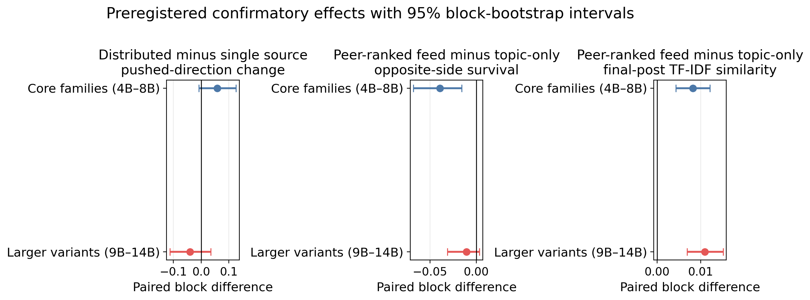
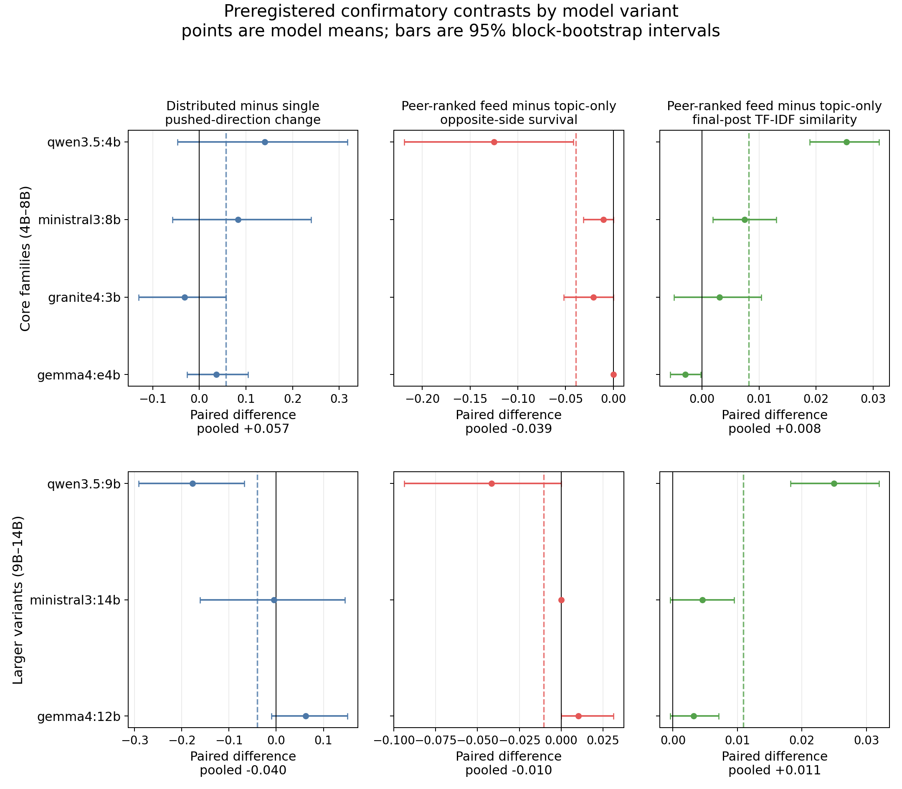

# Peer-Voted LLM-Agent Stress Tests Show Ranked Feeds Converge Discourse but Coordination Gains No General Advantage Under Matched Exposure

**Rana Muhammad Usman**

*Independent researcher*

*Correspondence:* `usmanashrafrana@gmail.com`

---

> **Code & data availability.** Complete experimental pipeline, fixed
> seeds, raw posts (59,776 production / 64,562 total including
> pipeline-verification smoke runs), paired peer-vote logs, embedding
> cache, the preregistered analysis plan (`PREREGISTRATION.md`), and the
> framing document (`FRAMING.md`) are released at
> <https://github.com/ranausmanai/synthetic-social-networks> and
> <https://huggingface.co/datasets/ranausmans/synthetic-social-networks>.
> All nine figures in this manuscript are rendered programmatically from
> the released data via `paper/make_figures.py`.

---

## Abstract

Collective behavior in LLM-agent populations is difficult to evaluate with
single-agent benchmarks or live experiments on human users. We present
PV-SST, a peer-voted social-platform testbed in which persona-conditioned
agents post, vote on one another, and receive those peer-generated signals in
subsequent rounds. An initial 80-trial study motivates two mechanism-level
hypotheses. We then test them in a separately frozen, preregistered
matched-exposure experiment comprising 448 trials, four topics, four unused
seeds, four current model families, and three prespecified larger variants.

The peer-ranked feed produces the clearest replicated effect relative to the
topic-only control: final-round honest-post TF-IDF similarity increases in
both the core-family panel (paired mean difference
+0.0082, 95% block-bootstrap CI [0.0043, 0.0121], randomization p=0.000105,
n=64 blocks) and the larger-variant panel (+0.0109 [0.0069, 0.0151],
p=0.000001, n=48). Opposite-side survival decreases in the core panel
(-3.9 percentage points [-6.8, -1.6], p=0.0068) but not conclusively in the
larger variants (-1.0 pp [-3.1, 0.4], p=0.50), making minority suppression a
model-dependent rather than universal result. Because peer-post exposure and
like ranking are bundled in this contrast, it does not identify a
ranking-only effect.

Holding adversarial impressions fixed, distributed coordinated accounts do
not reliably outperform one amplified source. The pushed-direction contrast
is positive but inconclusive in the core panel (+0.057 [-0.009, 0.125],
p=0.112) and negative in the size extension (-0.040 [-0.113, 0.035],
p=0.332), failing the preregistered consistency criterion. A separate
misinformation probe identifies two measurement failures: literal matching
misses paraphrases, while polarity-blind similarity conflates endorsement
with rebuttal. The evidence supports a peer-ranked-feed convergence
feed-convergence effect, rejects a model-general coordination advantage under equal exposure,
and leaves human-platform transfer untested. We release 59,776 production
posts, 528 production trials, peer-vote traces, code, and frozen protocols.

---

## 1. Introduction

LLM agents increasingly operate in shared environments as assistants,
simulated users, and autonomous participants. Research systems already model
populations ranging from small social sandboxes to large social-media
simulations (Park et al., 2023; Yang et al., 2024). Yet most LLM evaluation
remains centered on individual responses or task completion, leaving
collective behavior under platform feedback comparatively under-measured.

This creates a measurement problem for platform governance. The standard
question, "can one influential account manipulate users?", is too narrow for
LLM-heavy platforms. Operators also need to know whether ordinary engagement
UX changes the population before any attacker appears; whether coordinated
LLM accounts damage discourse even when they fail to win the majority; and
whether moderation systems built around literal claim detection still work
when agents paraphrase, reframe, and respond in natural language. These are
not questions that can be answered cleanly by live A/B tests on real users:
the interventions are adversarial, the outcomes concern persuasion and
misinformation, and the platform configurations of interest may not yet
exist in a controlled form.

Existing evidence does not close this gap. Human-subjects work establishes
that social proof, popularity signals, and fact-check labels can affect
behavior, but it does not measure LLM-agent populations. Classical opinion
dynamics models provide analytic clarity, but they replace language,
persona, and platform feedback with low-dimensional update rules. Early
LLM-agent simulations demonstrate that agents can produce social behavior,
but many use environment-assigned or heuristic feedback signals rather than
letting agents themselves create the social rewards that later shape the
platform. For Trust & Safety purposes, this leaves the central operational
question unanswered: **which platform mechanisms actually move an LLM-agent
population, and which popular threat models fail when tested under peer
feedback?**

We address this gap with a controlled, peer-voted social simulation testbed
(PV-SST). The testbed is intentionally small enough to audit and reproduce,
but rich enough to expose the platform loop that matters: LLM personas post,
other agents vote on those posts in character, and the resulting social
signals are fed back into future rounds. Each simulated user is an LLM-driven
persona drawn from a stratified pool of 24 personas, assigned an initial
stance on a debate topic and an in-character posting style. Across rounds,
each agent observes a platform-mediated feedback view, produces a short
post, votes on a random sample of others' posts, and updates its opinion and
confidence. Because every post, vote, stance update, and metric is logged
(with vote rationales in the exploratory stage), the system is designed as a
measurement instrument rather than as a black-box demo.

Within this simulation, we test four complementary threat vectors:

1. **Routine social-reward UX (EXP-1):** With all agents honest and no
   adversary, does the presence of standard platform UX, likes, visible
   majority indicators, leaderboards, downvotes, measurably distort the
   platform's discourse compared to a no-signal control?
2. **Coordinated-account astroturfing (EXP-2):** How few coordinated AI
   accounts pushing a shared opinion suffice to flip the platform's honest
   majority? Is there a clear threshold?
3. **Single-account influence amplification (EXP-3):** Does a single AI
   account with N× amplified reach, a *verified-badge-style attack*, shift
   honest opinion as the multiplier rises?
4. **Misinformation cascade and intervention effectiveness (EXP-6):** When
   one agent posts a designated false claim with high confidence, how rapidly
   does the claim's *thematic content* recur, and can literal or semantic
   metrics support a comparison of fact-check labels, deamplification, and
   community-notes-style rebuttal?

The same measurement logic requires a check on response sensitivity. We
therefore include a one-round bandwagon diagnostic (A1) and describe a
planned Reddit r/ChangeMyView replay (A2). **A1 is executed and reported
here. A2 was exercised only on five synthetic placeholder cases to verify
the pipeline and is not evidence.** Neither anchor validates transfer from
LLM agents to people; A1 instead reveals how strongly the two tested models
differ under an identical majority cue.
Two model families and matched random seeds enable cross-model comparison.

The resulting product of the paper is not a prediction engine for Instagram,
Snapchat, or X. It is a falsifiable threat-model probe: a way to test whether
specific platform mechanisms, coordinated populations, amplified accounts,
and moderation interventions move an LLM-agent population under controlled
conditions. If a mechanism fails here, that failure constrains the threat
model. If it succeeds here, it earns follow-up under larger samples, more
models, more topics, and direct human validation. This framing follows prior
simulation-based work in computational social science (Park et al., 2023;
Hegselmann and Krause, 2002) while adding a peer-voted platform feedback loop
and explicit response-sensitivity checks.

**Contributions.**

Methodologically, we contribute a **peer-voted social simulation testbed
(PV-SST)** in which LLM agents generate posts, cast in-character votes, and
receive those peer-generated signals in later rounds. The exploratory stage
stores vote rationales; the computationally larger confirmation stores
compact vote labels and parse status.
PV-SST is an auditable evaluation instrument for collective LLM behavior
rather than a claim of human fidelity.

- We release the complete testbed and 528 production trials, plus 24 A1
  diagnostics and 10 A2 model-case pipeline runs over five synthetic
  placeholders. The artifact contains
  59,776 production posts, paired vote traces, configurations, fixed seeds,
  embedding caches, and two frozen protocols. The release supports post-level
  auditing, while inference remains at the paired run-block level.
- We separate four mechanisms that are often conflated in platform-risk
  discussions: ordinary engagement feedback, coordinated-account load,
  one-account rank amplification, and misinformation interventions. The
  results identify repeatable directional patterns and, equally important,
  mechanisms that the present sample does not resolve.
- We provide an exact paired small-sample re-analysis. It shows consistent
  convergence at high coordinated-account load, no increased pushed-stance
  adoption under one-account amplification, and a separate decline in
  minority-view survival with amplification. Because the two probes are not
  exposure-matched, their contrast is a follow-up hypothesis rather than a
  causal result.
- We provide the missing matched-exposure test at scale: 448 additional
  trials over four topics, four new seeds, four current model families, and
  three larger variants. It confirms lexical convergence under a peer-ranked
  feed, qualifies minority-view suppression as model-dependent, and
  falsifies a model-general version of the population-driven-influence
  hypothesis under equal exposure.
- We document two measurement failures: **paraphrase leakage**, where
  full-keyword matching misses generated restatements, and **stance
  confounding**, where unconditioned semantic similarity conflates
  endorsement with refutation. These are warnings about the implemented
  baselines, not evidence that production moderation systems generally fail.
- We report the A1 response-sensitivity diagnostic (0/180 versus 14/180
  one-shot shifts across the two models) and explicitly leave human
  calibration unresolved.

---

## 2. Related work

**Multi-agent LLM simulations.** Park et al. (2023) established that LLM
agents can maintain personas, memories, and social routines. Subsequent work
has moved directly into opinion and platform dynamics. Chuang et al. (2024)
simulate opinion formation in networks of LLM agents; OASIS scales social-
media simulation to very large populations (Yang et al., 2024); SPARK jointly
models stance and topic evolution (Zhang et al., 2025); and MOSAIC combines
persona-conditioned agents, social graphs, engagement actions, and
misinformation interventions (Liu et al., 2025). PV-SST does not claim to be
the first LLM social simulator. Its narrower contribution is an auditable
peer-feedback loop in which the likes and downvotes shaping later rounds are
cast by agents in character and logged at the voter-target level. Exploratory
runs also preserve per-vote rationales; the larger confirmation uses compact
labels.

**LLM-agent population evaluation.** Recent work extends evaluation toward
behavioral fidelity and population scale. Park et al. (2024) construct
interview-conditioned agents for 1,052 people, while OASIS evaluates
large-scale diffusion, polarization, and herding. These systems establish
fidelity and scale as core dimensions. PV-SST instead emphasizes mechanism
isolation, raw-trace auditability, and explicit limits on human transfer.

**Opinion dynamics.** Classical models, DeGroot averaging (DeGroot, 1974),
Hegselmann–Krause bounded-confidence (Hegselmann and Krause, 2002), and the
Friedkin–Johnsen influence model, provide mathematical baselines for
opinion convergence under social influence. Their strength is analytic
clarity: assumptions are explicit and dynamics are tractable. Their weakness
for the present question is that they abstract away exactly the substrate
platforms now need to evaluate: language, persona, peer reward, paraphrase,
and moderation text. We use these models as conceptual anchors, but the
paper's contribution is empirical measurement in a language-producing,
peer-feedback system rather than another closed-form update rule.

**Social-proof and conformity dynamics.** Asch (1956) established that
humans conform to unanimous majority pressure in roughly one-third of
critical trials in a perceptual-judgement task. Salganik, Dodds, and Watts
(2006) demonstrated experimentally that exposure to popularity signals
increases both inequality and unpredictability of cultural-market outcomes.
Muchnik, Aral, and Taylor (2013) measured a 25 percent positive-herding bias
on a Reddit-like comment platform following a single arbitrary upvote. These
studies motivate A1's one-shot majority-cue diagnostic, but none provides a
like-for-like conversion to the discrete stance shifts used here.
Accordingly, we report A1 by model and do not treat a literature-derived
range as a calibrated human baseline.

**Conformity and minority expression in LLM collectives.** The closest
precedent to EXP-1 is Zhong et al. (2025), who show spiral-of-silence-like
majority dominance in LLM-agent rating systems when history and persona
signals are combined. Their multi-model evidence means minority decline in
an LLM collective is not novel by itself. EXP-1 instead asks which specific
engagement surfaces reproduce a related pattern when rewards are generated
by peers; the present sample supports only directional estimates.

**Influence operations and coordinated inauthentic behavior.** Empirical
measurement of real-world coordinated campaigns has been driven by industry
threat reports and academic analyses. Those reports are essential for
taxonomy and detection, but they rarely permit controlled counterfactuals:
the same platform cannot be rerun with K=1, K=3, K=5, K=10, and K=20
coordinated accounts while holding personas, topic, and feedback constant.
We adopt the *Coordinated Inauthentic Behavior* (CIB) framing used in
industry policy work, and use simulation to ask a counterfactual dose-response
question: how much coordinated population is needed before opinion and
discourse ecology move?

**Misinformation interventions.** Pennycook and Rand (2021) synthesize a
substantial body of human-subjects evidence on the psychology of fake news
and the effectiveness of accuracy-prompt and label interventions. In
LLM-agent settings, MOSAIC evaluates moderation strategies and Borah et al.
(2026) study demographic variation in misinformation susceptibility. Our
smaller intervention sweep (EXP-6) mirrors three platform policy levers:
fact-check labels, visibility reduction, and community-note-style rebuttal.
The contribution is not another intervention ranking.
It is an observed failure of two simple measurement choices on generated
discourse: strict surface-form matching has zero recall for paraphrased
claims, while unconditioned semantic proximity has no polarity. EXP-6 is
therefore a measurement audit, not a moderation-effectiveness study.

**Algorithmic shaping of exposure.** Bakshy, Messing, and Adamic (2015) showed
that Facebook's algorithmic ranking removes about 15 percent of cross-cutting
political content from users' feeds, with users' own click-through behavior
removing 70 percent more. EXP-1 is complementary in framing: where Bakshy et
al. measure exposure filtering for human users, we treat engagement surfaces
as controlled inputs to an LLM-agent population. The paper does not infer
human-platform effects from that comparison.

---

## 3. Methodology

### 3.1 Platform simulation

Each simulated run constructs an N-agent platform on a single debate topic
("Should AI-generated content be labeled on social platforms?" for the runs
reported here). Every agent is initialized with: (a) a unique persona drawn
from a 24-persona pool stratified by narrative group (marginalized,
mainstream, contrarian); (b) one of seven discrete initial stances ranging
from "strongly support" through "strongly oppose"; (c) a confidence level
correlated with stance extremity; (d) a posting-style descriptor; (e) an
empty memory.

For R rounds, each agent in turn (i) reads its **feedback block**, the
platform-mediated view of prior-round activity, varied by condition (§3.2);
(ii) produces one short JSON-structured post (at most 280 characters) in its
persona's voice; (iii) updates its stance and confidence, with a brief
reason. Generation uses the Ollama runtime with reasoning-token emission
disabled, returning compact structured JSON outputs.

### 3.2 Feedback conditions

Five feedback conditions define what agents see between rounds:

- **control**, only the topic and the agent's own persona.
- **likes**, the top-K liked posts from the previous round.
- **majority**, a summary of the previous round's stance distribution and
  modal opinion.
- **leaderboard**, cumulative top-K agents by total likes across all rounds.
- **downvote**, the most-downvoted dissenting posts, framed as flagged.

### 3.3 Peer voting

In all production conditions, the likes and downvotes used to construct
feedback are produced by **peer voting**: every round, each agent reads a
random sample of K=5 posts from the prior round (excluding its own) and votes
+1 / 0 / −1 on each in character. This replaces the pipeline's earlier
heuristic majority-alignment proxy with peer-voted feedback,
in which the social-reward signal that shapes subsequent rounds is produced
by other agents' in-character judgements rather than by environment-imposed
heuristics. Every trial preserves voter id, target id, vote, and parse status.
The exploratory stage additionally preserves an in-character reason; the
confirmatory stage omits reasons under its frozen compact-vote protocol. We
refer to the combined design,
peer-voted feedback plus persona-based agents, multi-round simulation, and full
vote-trace logging, as the **peer-voted social simulation testbed
(PV-SST)**, and treat it as a primary methodological contribution.

### 3.4 Metrics

Six primary metrics are computed per round and aggregated to scalars:

- **majority fraction**, share of agents on the modal stance.
- **persona retention**, mean cosine similarity (in `nomic-embed-text`
  embedding space) between an agent's post and its persona descriptor.
- **opinion shift rate**, fraction of agents whose stance differs from
  their initial.
- **confidence trajectory**, mean & std of agent-reported confidence per
  round.
- **minority-view survival**, fraction of round-0 minority stances still
  present in the final round.
- **mean pairwise post similarity**, embedding-cosine, indexing linguistic
  homogenization.

A composite `persona_collapse_score = 0.5·majority_fraction + 0.3·pairwise_sim
+ 0.2·(1 − persona_retention)` is reported but always alongside its
components.

For EXP-2 and EXP-3 we report two complementary flip criteria. The **strict**
criterion (honest-pushed-share > 0.5 on the *exact* pushed stance bucket)
corresponds to the preregistered `final_honest_pushed_share` outcome. The
**broad** criterion (honest-pushed-share > 0.5 on the three-bucket side
containing the pushed stance) was introduced post-hoc but is motivated by the
preregistration's commitment to report direction-of-opinion shifts; we mark
it explicitly as post-hoc throughout.

For EXP-6, the preregistered primary outcome is the **literal keyword-based**
`final_endorser_share`. After observing that this metric returned zero across
all 16 trials (agents paraphrased rather than reproducing keywords), we
developed a **semantic embedding-based thematic-similarity** analysis as a post-hoc
secondary metric (§8.3). We report both and clearly label the semantic
analysis as thematic proximity, not endorsement.

We additionally run a post-hoc stance-label validation on all 608 honest-
agent endpoint posts (rounds 0 and 9). Two independent local judges
(`qwen2.5:7b` and `llama3.1:8b`, temperature 0) assign one of `endorse`,
`reject`, `neutral`, or `unrelated` toward the specific seeded allegation.
Before producing a consensus label, we require raw agreement of at least
0.70 and Cohen's kappa of at least 0.50. If either gate fails, judge-specific
outputs are retained but no adjudicated endorsement result is reported. The
prompts, labels, and analysis are released in `src/analyze_misinfo_stance.py`
and `paper/stance_analysis/`.

### 3.5 Preregistration and falsification criteria

Before production runs we committed an analysis plan (`PREREGISTRATION.md`)
including primary outcomes, planned statistical tests, and explicit
falsification criteria for each hypothesis. We additionally committed a
framing document (`FRAMING.md`) specifying what claims the simulation does
and does not support. Both files carry the git timestamp predating the first
production trial.

### 3.6 Deviations from the preregistration

We disclose all sample-size deviations between the preregistered design and
the executed runs, with the reason for each.

| Aspect | Preregistered (PREREGISTRATION.md §"Sample sizes") | Executed | Reason for deviation |
|---|---|---|---|
| EXP-1 seeds × rounds × agents | 2 models × **3** seeds × 5 conditions × 20 agents × **20** rounds | 2 × **2** × 5 × 20 × **15** | Compute budget; reduced to fit single-GPU 57-hour chain |
| EXP-2 seeds × rounds × baseline agents | 2 × **3** × 6 K × **50** baseline × **12** rounds | 2 × **2** × 6 × **30** × **10** | Compute budget; full prereg sample would have required ~140 GPU-hours |
| EXP-6 seeds × rounds × agents | 2 × **3** × 4 interventions × **25** agents × **12** rounds | 2 × **2** × 4 × **20** × **10** | Compute budget |
| EXP-3 (influence-amplification) | *Not in preregistration* | Added post-hoc, 2 × 2 × 5 multipliers | Exploratory addition during the chain run |
| Broad-side flip criterion (EXP-2) | *Not in preregistration* | Reported alongside preregistered strict criterion | Added post-hoc after strict criterion returned uninformative results at low K |
| Thematic-similarity metric (EXP-6) | *Not in preregistration* | Reported as exploratory alongside preregistered keyword metric | Added post-hoc after keyword metric returned 0 across all 16 trials |
| Statistical tests (Bonferroni-corrected t-tests) | *Preregistered* for primary outcomes | Replaced by exact paired sign-flip tests | n=2 seeds makes asymptotic t-tests unreliable; exact tests preserve the model-by-seed block |

**Implication.** Because the executed sample is smaller than the preregistered
design across every experiment, **none of the results reaches the
preregistered confirmatory-significance bar.** They are exploratory
effect estimates from a smaller-than-planned sample.

**Small-sample analysis.** We treat each matched `(model, seed)` pair as one
run-level block and never treat posts, agents, or rounds as independent
replicates. For every treatment-control contrast we report the mean paired
difference and a two-sided exact sign-flip p-value over the four blocks.
With four blocks, the smallest attainable two-sided p-value is 2/16 = 0.125,
even when all four differences share a sign. Because the two model families
are fixed and each contains only two random seeds, these p-values and
block-bootstrap intervals are descriptive sensitivity summaries, not
population-calibrated inference over models, topics, or platforms. The
complete table and executable analysis are released as
`paper/robustness_results.md`, `paper/robustness_results.csv`, and
`src/analyze_robustness.py`.

### 3.7 Response-sensitivity and human-validation plan

We designed one response-sensitivity diagnostic and one human-validation
plan. A1 is an executed one-shot majority-cue diagnostic; A2 is a deferred
human-replay design. Because the A1 stimulus and outcome are not matched to a
human experiment, we do not call it a calibration or use it to scale any
main result.

Anchor A1 (bandwagon-conformity) shows agents a synthetic "X% of users agree"
signal and measures the conformity shift among initially-disagreeing agents.
Muchnik et al. (2013) and Salganik et al. (2006) motivate the choice to test
a visible social signal, but their treatments and outcomes are not
commensurate with A1's discrete stance transitions. We therefore do not
construct a human reference band from those studies.

Anchor A2 (ChangeMyView replay) is *designed* to feed real r/ChangeMyView
conversations through our simulation and compare predicted view-changes to
documented delta-award outcomes. For this submission we executed A2 only
against a 5-case synthetic placeholder dataset, which verifies the
pipeline end-to-end but does **not** constitute a calibration; the
production A2 run on the real corpus remains a methodological priority
(§10.3, §11).

---

## 4. Experimental setup

**Models.** Two open-weight LLMs via Ollama: `qwen3.5:2b` (Alibaba,
approximately 2.3B parameters) and `llama3.2:3b` (Meta, approximately 3B
parameters), using the default local Ollama model tags configured for the
experiment.

**Seeds.** Two seeds per cell ({42, 7}) for variance estimation. We
acknowledge n=2 is a floor for the exploratory stage; see Limitations (§11).

**Sample sizes per experiment.**

| Experiment | Trials | Agents per trial | Rounds | Conditions |
|---|---|---|---|---|
| EXP-1 baseline | 20 | 20 | 15 | 5 |
| EXP-2 astroturfing | 24 | 30 + K | 10 | 1 (inner) × 6 K |
| EXP-6 misinformation | 16 | 20 | 10 | 4 interventions |
| EXP-3 influence | 20 | 30 + 1 | 10 | 5 multipliers |
| Confirmatory extension | 448 | 12 honest + 0/1/4 adversarial | 6 | 4 paired conditions |
| A1 bandwagon anchor | 24 | 30 | 1 | 3 majority strengths × 2 sides |

**Compute.** The initial experiments executed on an RTX 4000 Ada workstation
GPU in approximately 57 hours. The confirmatory extension executed on one
RTX 5090 and adds 35,616 posts and 32,256 peer-voter calls. Across the
reported production experiments, the artifact contains 59,776 agent posts.

**Code, configs, raw logs.** Released alongside this paper at the project
repository (<https://github.com/ranausmanai/synthetic-social-networks>) and
dataset repository
(<https://huggingface.co/datasets/ranausmans/synthetic-social-networks>),
including all per-agent posts and peer-vote logs to permit independent
re-analysis.

---

## 5. EXP-1, Baseline degradation under standard social-reward signals

### 5.1 Hypothesis

H1 (preregistered): *Across model families, each social-pressure condition
will produce measurable shifts versus `control` on at least one primary
outcome.*

### 5.2 Design

For each of the five conditions, we run 2 models × 2 seeds = 4 trials of 20
agents × 15 rounds with peer voting.

### 5.3 Results

**Figure 1** plots every model-by-seed block and the block mean.


| Condition | persona retention | pairwise sim | minority survival | majority fraction |
|---|---|---|---|---|
| control | 0.547 | 0.636 | 0.725 | 0.487 |
| likes | 0.540 | 0.672 | 0.667 | 0.500 |
| majority | 0.544 | 0.619 | 0.567 | 0.550 |
| leaderboard | 0.542 | 0.661 | 0.567 | 0.500 |
| downvote | 0.532 | 0.668 | 0.571 | 0.488 |

**Δ versus control, primary outcomes:**

| Condition | Δ minority survival | Δ pairwise sim | Δ majority concentration |
|---|---|---|---|
| likes | −5.8 pp | +3.6 pp | +1.3 pp |
| majority | −15.8 pp | −1.7 pp | +6.3 pp |
| leaderboard | −15.8 pp | +2.5 pp | +1.3 pp |
| downvote | −15.4 pp | +3.2 pp | +0.1 pp |

### 5.4 Interpretation

The condition means are compatible with engagement surfaces acting as
treatments, but they do not establish general minority-view suppression.
Mean minority survival is lower than control under all four treatments
(−5.8 to −15.8 percentage points), yet the paired block signs are mixed:
likes 1/2/1 positive/negative/tied blocks (p=0.500), majority 0/2/2
(p=0.500), leaderboard 1/3/0 (p=0.250), and downvote 0/3/1 (p=0.250).
The wide control range [0.50, 1.00] contains every treatment range.

The clearest EXP-1 pattern is instead linguistic convergence under `likes`.
Final pairwise post similarity rises by 3.66 points relative to control in
all four model-by-seed blocks (95% descriptive block-bootstrap interval
[+0.36, +8.42] points; exact p=0.125). The corresponding effects are +6.97
points for qwen3.5:2b and +0.36 for llama3.2:3b, so magnitude remains
model-dependent. Other engagement treatments do not show the same four-block
consistency on pairwise similarity.

H1 required each treatment to move at least one primary outcome. The
directional means are compatible with H1, but the reduced design does not
meet its preregistered confirmatory criterion. This is best read as a
screening result: peer-generated likes repeatedly homogenize language in the
tested population, while the broader minority-survival pattern requires more
seeds before it can support a suppression claim. This positioning also
distinguishes EXP-1 from prior multi-model evidence for spiral-of-silence
dynamics (Zhong et al., 2025).

**Result summary.** *Likes increased linguistic similarity in all four
model-by-seed blocks. Minority-survival means declined under every engagement
treatment, but blockwise inconsistency and wide overlap prevent a firm
minority-suppression conclusion.*

---

## 6. EXP-2, Coordinated-account astroturfing dose-response

### 6.1 Hypothesis

H2 (preregistered): *There exists a threshold K\* such that injecting at least K\*
coordinated AI accounts into an N-agent platform flips honest-majority
opinion in at least 50% of (model, seed) runs. Prior expectation: K\*/N at
most 0.20.*

### 6.2 Design

Population: 30 honest agents (independent personas, randomly-distributed
initial stances) + K coordinated agents, where K is one of
{0, 1, 3, 5, 10, 20}.
Coordinated agents share a pushed opinion ("strongly support") and a
scripted angle they reinforce naturally across rounds. All trials run under
the `likes` condition with peer voting, 10 rounds, 2 models × 2 seeds × 6
K-values = 24 trials total.

### 6.3 Dual flip criteria

We report two flip-rate metrics, one preregistered and one post-hoc:

- **Strict (preregistered):** honest-pushed-share > 0.5 on the *exact*
  pushed stance ("strongly support"), a single bucket of seven. This is
  the operationalization of the preregistered `final_honest_pushed_share`
  outcome.
- **Broad (post-hoc):** honest-pushed-share > 0.5 on the *side* containing
  the pushed stance (the combined "strongly support," "support," and
  "lean support" buckets),
  three buckets of seven. This metric was specified after observing that
  the strict criterion returns near-uniform zero across most K (since the
  natural base rate of any single stance bucket is about 1/7, or 14%, making a
  >50 % single-bucket adoption a particularly strong opinion-adoption
  criterion). The broad metric is consistent with the preregistration's
  general commitment to reporting direction-of-opinion shifts, but it was
  not pre-specified at the bucket-aggregation level. We report both
  honestly and label each at every appearance.

### 6.4 Results

**Figure 2** plots the dose-response for both criteria.


| K | strict flip rate | broad flip rate | Δ broad-shift vs K=0 |
|---|---|---|---|
| 0 | 0% | 50% (baseline noise) | 0.000 |
| 1 | 0% | 0% | +0.017 |
| 3 | 0% | 25% | 0.000 |
| 5 | 0% | 25% | +0.042 |
| 10 | 0% | 50% | +0.025 |
| **20** | **50%** | **50%** | **+0.092** |

The "Δ broad-shift vs K=0" column reports `(final_broad − initial_broad)
for K_X minus (final_broad − initial_broad) for K=0`. That is, it
compares the **per-K change-from-initial against the control's change-
from-initial**, not the simple difference of final broad shares. We use
this because initial broad shares vary slightly across cells due to
random persona/stance assignment; this measure isolates the
coordination-induced shift from the baseline drift.

```{=latex}
\newpage
```

**Figure 3** shows simultaneous degradation of four information-ecology
metrics at the K=20 threshold:


| Metric | K=0 | K=20 | Δ |
|---|---|---|---|
| pairwise post similarity (linguistic homogeneity) | 0.680 | 0.719 | **+3.9 pp** |
| minority-view survival | 0.575 | 0.483 | **−9.2 pp** |
| majority concentration | +0.092 | +0.140 | **+4.8 pp** |
| composite collapse score | 0.503 | 0.651 | **+14.8 pp** |

### 6.5 Interpretation

High coordinated-account load produces the most internally consistent
changes in the study. Relative to K=0, K=20 increases the change in exact
pushed-stance share by 18.3 points, final pairwise similarity by 3.9 points,
the change in modal-stance concentration by 4.8 points, and the preregistered
collapse score by 14.8 points. Every one of these four contrasts has the same
direction in all four model-by-seed blocks (exact p=0.125 for each). The
within-block linear slope of exact pushed-stance change over K is also
positive in all four blocks (+0.0075 per coordinated account, p=0.125).

Two commonly quoted summaries are weaker. Minority-view survival falls by
9.2 points on average, but only two blocks decline and two tie (p=0.500).
The broad-side metric is noisy: K=0 already produces broad flips in 2/4
trials, and the K=20-minus-K=0 broad-shift contrast has mixed block signs
(+9.2 points, p=0.500). We therefore treat the preregistered exact stance and
ecology metrics, not the post-hoc broad flip rate, as the primary evidence.

At K=20, 2/4 trials cross the preregistered strict-majority threshold versus
0/4 at K=0 (paired exact McNemar p=0.500). Both events occur at seed 7,
one per model; neither seed-42 trial flips. The data consequently do not
identify a reliable threshold. They also falsify the preregistered prior
K*/N <= 0.20: the 50% flip criterion appears only at K/N=0.40, the highest
load tested.

**Result summary.** *At the largest coordinated-account load, exact
pushed-stance movement, linguistic convergence, modal-stance concentration,
and the preregistered collapse score shift in the same direction in all four
blocks. The sample does not establish a flip threshold, and low-ratio
coordination does not reproduce a dramatic takeover.*

---

## 7. EXP-3, Single-account influence amplification (verified-badge attack)

### 7.1 Hypothesis

EXP-3 was **added post-preregistration** to test a distinct attack vector,
single-account visibility amplification, that was not part of the original
analysis plan. The preregistered H4 in our analysis plan pertains to
persona-group vulnerability under social pressure and is not reported in
this manuscript. We frame EXP-3 as an exploratory post-prereg experiment
with the following hypothesis:

*A single AI account with sufficient visibility amplification will produce
increasing honest-agent adoption of its pushed stance.*

### 7.2 Design

Population: 30 honest baseline agents + 1 "influencer" agent assigned a
"prominent verified industry commentator" persona and a fixed pushed stance.
At multipliers > 1, the influencer is force-included in every honest agent's
`likes` feed *and* its effective like-rank is multiplied by the visibility
multiplier (so even at low actual peer-vote counts it dominates the
top-K). At 1× the influencer receives no special treatment and competes for
top-K visibility on equal terms with the 30 baseline agents, so the 1× cell
serves as a "boosting-off control" rather than an influencer-absent control.
We sweep the multiplier across {1, 3, 5, 10, 20}. 2 models
× 2 seeds × 5 multipliers = 20 trials total. Inner condition: `likes` with
peer voting, 10 rounds.

EXP-3 is not a matched counterpart to EXP-2. EXP-2 adds K posting and voting
accounts and uses a six-item feed; EXP-3 adds one account, uses a five-item
feed, and for multipliers above 1 force-includes that account while changing
its rank score. Population size, total attacker-authored content, feed depth,
and exposure are therefore different. Cross-experiment contrasts are
descriptive only.

### 7.3 Results

**Figure 4** plots pushed-stance change and minority survival for every
model-by-seed block.

```{=latex}
\clearpage
```


| Multiplier | final broad share | final strict share | broad flip rate | minority survival |
|---|---|---|---|---|
| 1× (control) | 0.492 ± 0.036 | 0.400 | 75% | 0.725 |
| 3× | 0.442 ± 0.064 | 0.400 | 25% | 0.442 |
| 5× | 0.475 ± 0.043 | 0.367 | 50% | 0.650 |
| 10× | 0.492 ± 0.083 | 0.392 | 50% | 0.733 |
| 20× | 0.433 ± 0.085 | 0.358 | 25% | 0.483 |

### 7.4 Interpretation

Amplification does not increase adoption of the influencer's pushed stance.
From 1x to 20x, the paired change in strict pushed-stance share is −6.7
points (0/3/1 positive/negative/tied blocks, p=0.250), and broad-side change
is −5.0 points with mixed signs (2/2/0, p=0.500). Within-block slopes over
log2(multiplier) are likewise non-positive on average for both strict and
broad stance change. These data reject the exploratory hypothesis's expected
positive dose-response within this implementation; they do not establish
backfire.

A different outcome moves: minority-view survival declines from 0.725 at 1x
to 0.483 at 20x, a paired difference of −24.2 points (0/3/1 blocks,
p=0.250). The within-block slope over log2(multiplier) is negative in all
four blocks (−2.5 points per doubling, p=0.125), although the condition means
are visibly non-monotonic and the metric is coarse. The careful
interpretation is that rank amplification did not steer agents toward the
promoted stance but may still alter which minority stances persist.

EXP-2 and EXP-3 consequently motivate, but do not test, a population-versus-
rank mechanism hypothesis. A valid causal comparison would hold total
attacker impressions, attacker-authored posts, population size, feed depth,
and initial stances constant. The present experiments hold none of those
quantities jointly fixed, so Trust & Safety prioritization cannot be inferred
from their difference.

**Result summary.** *One-account rank amplification shows no positive
pushed-stance dose-response. An exploratory minority-survival slope is
negative in all four blocks, indicating that “no persuasion” is not the same
as “no ecological effect.”*

---

## 8. EXP-6, Misinformation cascade and intervention effectiveness

### 8.1 Hypothesis

H3 (preregistered): *At least one of {fact-check label, deamplification,
rebuttal} will produce a statistically significant reduction in final
endorsement share versus the no-intervention baseline.*

### 8.2 Design

One designated agent (`a00`) is seeded with a domain-plausible but factually
contestable claim and instructed to repeat its themes with high confidence
across all rounds. Nineteen honest agents share the platform under the
`likes` condition with peer voting, for 10 rounds.

Four intervention regimes:

- **none**, baseline; no platform action against the false claim.
- **factcheck_label**, environment appends a "[DISPUTED, independent
  fact-checkers found no evidence]" tag to any post containing the claim's
  keyword set when displayed to other agents.
- **deamplify**, posts containing the claim are filtered out of the feed
  entirely.
- **rebuttal**, every round, a high-credibility rebuttal post is pinned in
  every agent's feed.

2 models × 2 seeds × 4 interventions = 16 trials.

### 8.3 Metric audit: surface matching vs thematic similarity

A literal detector counted a post only when all three configured strings
(`90%`, `ai labs`, `suppress`) were present. It returned zero honest-agent
matches across all 16 trials. The zero is not evidence of zero endorsement:
the raw logs contain close restatements that fail the conjunction, for
example, *"How can we trust labels when 90% of AI lab drafters are also the
ones suppressing competition?"* Conversely, many posts discuss regulation,
markets, or AI labs without endorsing the seeded allegation.

We therefore developed a post-hoc **thematic-similarity** analysis: we embed
each honest-agent post and the seeded false claim with `nomic-embed-text`,
then use cosine similarity as a measure of thematic proximity. It is not an
endorsement measure because cosine similarity has no stance or polarity.

### 8.4 Results

**Figure 5** plots the per-intervention thematic-similarity change.


| Intervention | Δ similarity (mean ± std) | final similarity | above 0.55 threshold | paired Δ vs none |
|---|---|---|---|---|
| none | +0.017 ± 0.019 | 0.580 | 14.5 / 19 | 0.000 |
| factcheck_label | −0.018 ± 0.023 | 0.557 | 10.8 / 19 | −0.035 |
| deamplify | +0.021 ± 0.006 | 0.589 | 13.5 / 19 | +0.004 |
| rebuttal | +0.031 ± 0.049 | 0.643 | 18.0 / 19 | +0.014 |

```{=latex}
\newpage
```

The stance-label validation fails its reliability gate. Across 608 endpoint
posts, the two judges agree on 43.6% of labels (Cohen's kappa = 0.258).
Their mean endorsement changes also disagree in direction:

| Intervention | qwen2.5:7b Δ endorsement | llama3.1:8b Δ endorsement |
|---|---:|---:|
| none | −0.026 | +0.026 |
| factcheck_label | +0.079 | −0.013 |
| deamplify | +0.118 | +0.053 |
| rebuttal | 0.000 | +0.066 |

Because both agreement criteria fail, we do not adjudicate these labels or
use either judge to rank interventions.

### 8.5 Interpretation

The principal EXP-6 result is a paired measurement failure. We call the
all-keyword detector's false negatives for close restatements **paraphrase
leakage**. We separately call the embedding metric's inability to distinguish
endorsement from refutation **stance confounding**. Thus the preregistered
primary outcome cannot test H3, and the post-hoc similarity measure cannot
repair it. These failures are specific to the simple baselines implemented
here; they are not claims about modern production moderation systems.

The failed stance audit shows that replacing cosine similarity with an
unvalidated LLM judge is not sufficient. The judges disagree on both label
identity and treatment direction; for example, fact-check labels increase
estimated endorsement under qwen2.5:7b but decrease it under llama3.1:8b.
Human annotation or a validated domain-specific stance model is required.

The similarity contrasts quantify the artifact rather than intervention
effectiveness. Fact-check labels reduce similarity change versus no
intervention by 3.46 points in all four blocks (exact p=0.125). Deamplification
differs by +0.35 points with mixed signs (p=0.750), and rebuttal by +1.42
points with mixed signs (p=0.375). The rebuttal condition injects text about
the same topic, so higher similarity is expected even when agents reject the
claim. Labels can likewise alter vocabulary without altering belief.

The implementation also explains why literal deamplification is ineffective
as a filter: it removes only posts containing the full three-string
conjunction. Close restatements remain visible. The defensible conclusion is
therefore methodological: surface matching and polarity-blind similarity
bracket the problem but do not measure misinformation adoption. A validated
stance-aware annotation is required before H3 or any intervention ranking can
be evaluated.

---

```{=latex}
\newpage
```

## 9. Preregistered matched-exposure confirmation

### 9.1 Design and audit

The exploratory study leaves two decisive questions: whether the engagement
effect survives broader replication, and whether coordinated populations have
an effect beyond receiving more impressions than one account. Before
inspecting outcomes, we froze `CONFIRMATORY_PREREGISTRATION.md`. The core
crosses four model families (Qwen 3.5 4B, Gemma 4 E4B, Ministral 3 8B, and
Granite 4 3B), four platform-policy topics, four unused seeds, and four paired
conditions, yielding 256 trials and 64 model-topic-seed blocks. A prespecified
size extension applies the identical matrix to Qwen 3.5 9B, Gemma 4 12B, and
Ministral 3 14B, yielding 192 trials and 48 blocks.

Each trial contains 12 honest agents with exactly balanced initial stances.
The conditions are a topic-only control, a feed of five previous-round peer
posts ranked by peer-generated likes, one adversarial source, and four
coordinated adversarial sources. The peer-ranked-feed contrast intentionally
tests that platform surface as a bundle; it does not separate exposure to
peer posts from ranking by likes. In both attack conditions,
every honest agent receives exactly one adversarial and four organic feed
impressions after round 0; the attacker argument prompt, number of adversarial
impressions, feed depth, rounds, and honest voters are held fixed. The
distributed arm generates four account-specific realizations of that prompt
and rotates them across viewers, whereas the single-source arm generates one
realization per round. The contrast therefore tests a coordinated-source
package, source multiplicity plus cross-viewer message variation, under equal
impressions. All 448 trials completed. Every block contains all four
conditions, all exposure audits pass, and no model exceeds the preregistered
5% parser-warning threshold.

The inferential unit is the paired model-topic-seed block. We report paired
means, 20,000-draw block-bootstrap intervals, exact sign tests, and exhaustive
or one-million-draw sign-flip randomization tests. The primary coordination
outcome is change in mean honest-agent stance aligned with the attack
direction. Confirmatory lexical similarity is the mean off-diagonal cosine
similarity among TF-IDF vectors for the 12 honest agents' final-round posts;
the vocabulary is fitted within each trial endpoint. Peer-ranked-feed outcomes
are reported separately rather than combined after observing results.

### 9.2 Results



```{=latex}
\newpage
```

| Panel and preregistered contrast | n blocks | paired mean | 95% bootstrap CI | randomization p |
|---|---:|---:|---:|---:|
| Core: PDI primary | 64 | +0.0573 | [-0.0091, +0.1250] | 0.1124 |
| Larger: PDI primary | 48 | -0.0399 | [-0.1128, +0.0347] | 0.3317 |
| Core: feed survival | 64 | -0.0391 | [-0.0677, -0.0156] | 0.0068 |
| Larger: feed survival | 48 | -0.0104 | [-0.0312, +0.0035] | 0.5000 |
| Core: feed TF-IDF similarity | 64 | +0.0082 | [+0.0043, +0.0121] | 0.000105 |
| Larger: feed TF-IDF similarity | 48 | +0.0109 | [+0.0069, +0.0151] | 0.000001 |

The peer-ranked feed increases final-round honest-post TF-IDF similarity in
both panels. The effect is positive
for three of four core models and all three larger variants; the pooled
direction is also positive for every topic in each panel. This is the
confirmatory result: exposure to a peer-ranked feed produces lexical
convergence even without an adversary. The effect size is modest, 0.008 to
0.011 TF-IDF cosine-similarity units, and should not be described as opinion
capture or as a ranking-only effect.

Opposite-side survival falls in the core panel, but the model strata reveal
that Qwen 3.5 4B carries most of the effect (-12.5 pp); Gemma E4B is exactly
null and the other core-family estimates are small. The larger variants are
inconclusive. The expanded evidence therefore narrows the old claim:
peer-ranked-feed minority suppression occurs in some model populations,
not as a model-general law.

The population-driven-influence criterion is not met. Although the core
estimate is positive, only three of four model families and two of four
topics are positive, and its interval crosses zero. More importantly, the
separately analyzed larger variants have a negative pooled estimate, with
only one of three variants and one of four topics positive. Under matched
exposure, the tested distributed-source package has no reliable advantage
over one source. This falsifies the general PDI hypothesis as originally
framed; it does not show that real coordinated campaigns are harmless,
because real campaigns can gain exposure, optimize message diversity, exploit
networks, and interact with people.



```{=latex}
\clearpage
```

---

## 10. Cross-model and response-sensitivity diagnostics

### 10.1 Cross-model heterogeneity

**Figure 8** disaggregates EXP-6 by model family.


| Intervention | qwen3.5:2b Δ similarity | llama3.2:3b Δ similarity |
|---|---|---|
| none | about 0.000 | +0.036 |
| factcheck_label | −0.039 | +0.004 |
| deamplify | +0.024 | +0.018 |
| rebuttal | −0.014 | +0.077 |

In the no-intervention baseline, qwen3.5:2b shows a mean Δ similarity of
−0.001 (essentially zero, with one trial slightly negative and one slightly
positive), while llama3.2:3b shows +0.036 (both trials positive). Across
all four interventions, qwen3.5:2b's mean Δ is −0.008 (essentially zero
with high variance) while llama3.2:3b's mean Δ is +0.034 (consistently
positive). **The cross-model difference is qualitative, qwen does not
exhibit positive theme-similarity drift in this metric, while llama does,
instead of a
fixed quantitative ratio.** We deliberately avoid the framing "llama
"drifts N times more than qwen" because qwen's baseline rate is near
zero, which makes any multiplicative ratio mathematically uninformative.

This single comparison (n=2 model families, n=2 seeds per model per
intervention cell) does not generalize to a claim about cross-model
heterogeneity in the broader open-weight LLM population. It does, however,
motivate the methodological observation that when deploying LLM-driven
account populations (companion bots, customer-service agents, AI personas,
automated influencers), the underlying language model may be a
non-trivial source of variance in platform-integrity metrics. Establishing
this as a general pattern would require replication across 5–10 model
families.

### 10.2 A1 response-sensitivity diagnostic

**Figure 9** plots the A1 result by model.


Across all 24 A1 trials (two models × two seeds × three majority-claim
strengths × two pushed-stance sides), **14 of 360 minority agents shifted
toward the claimed-majority stance** after a single round of bandwagon-signal
exposure, for a pooled conformity rate of **0.039**. The result
is strongly heterogeneous by model:

- **llama3.2:3b**: 0 of 180 minority agents shifted across 12 trials
  (pooled rate 0.000; every trial 0.000).
- **qwen3.5:2b**: 14 of 180 minority agents shifted across 12 trials
  (pooled rate 0.078; per-trial range 0.000 to 0.267).

The overall pooled rate is 0.039, but pooling is secondary because model
identity almost completely determines the response. Agent-level binomial
intervals would incorrectly treat agents nested in the same trial as
independent, so we report trial values rather than such intervals. A1 therefore
supports one conclusion only: sensitivity to an identical social cue is
model-dependent in this testbed. It does not rank these agents against
humans, validate behavioral realism, or scale any main-experiment effect.

### 10.3 A2 human-validation plan, status: deferred

Our analysis plan included a second validation design (A2): predicting
real human view-shifts on Reddit r/ChangeMyView conversations. We
implemented the pipeline and verified it end-to-end against a 5-case
synthetic dataset, but we did **not** execute A2 on the production CMV
corpus before this submission. The synthetic-pipeline run verifies software
only. Until A2 or another matched human study is executed, simulation-to-
human transfer remains untested.

---

## 11. Limitations and threats to validity

**Two-stage evidence.** Sections 5–8 remain exploratory: their cells use two
seeds and one topic, and four paired blocks permit a minimum two-sided exact
p-value of 0.125. Section 9 is a separately frozen confirmation with four new
seeds, four topics, four core families, three larger variants, and 112
complete paired blocks. The extension materially improves precision and
scope, but model-topic-seed blocks are crossed observations from one
simulation architecture, not 112 independent platforms or human populations.
The preregistered bootstrap and randomization tests treat complete paired
blocks as exchangeable simulation replications; model- and topic-stratified
estimates are reported to expose dependence on either factor.

**Multiplicity.** The PDI stance contrast is the preregistered primary test.
The feed outcomes are reported as separate secondary estimands, alongside all
six outcomes in the released analysis table, without family-wise
multiplicity adjustment. Their p-values are nominal. The lexical-similarity
finding is emphasized because its interval excludes zero in both separately
analyzed panels and its direction is positive across all topic strata, not
because it was selected from a single favorable table cell.

**Within-cell variance overlaps between-cell effects (EXP-1 §5.4).** The
control condition's per-trial minority-survival range [0.50, 1.00] spans
the per-trial ranges of every pressure condition. Our reported 6–16 pp
direction-of-means effects are smaller than within-cell variability. We
report these as screening estimates, not as evidence that every engagement
surface suppresses minority views.

**Seed confound in the K=20 flip (EXP-2 §6.5).** Both K=20 trials that
flipped occurred at the same random seed (seed=7), in both qwen and llama.
Neither seed=42 trial flipped, in either model. With n=2 seeds we cannot
disentangle a coordination-driven flip from a seed-driven flip; the 40 %
coordination threshold should be read as the smallest K at which any flip
was observed in this study, not as a firm threshold estimate.

**Model scope.** The exploratory stage uses two 2–3B models. The confirmatory
stage adds four current open-weight families and three 9B–14B variants, but
does not include proprietary frontier models. Size variants from one family
are analyzed separately rather than counted as independent families. The
results describe these seven variants under one inference stack.

**Mechanism contrast.** EXP-2 and EXP-3 differ in population size,
attacker count, attacker-authored post volume, feed depth, forced inclusion,
and rank manipulation, so their historical contrast is not causal. Section 9
supplies the matched-exposure test and finds no reliable distributed-source
advantage. Its contrast bundles source multiplicity with independently
generated realizations of a shared argument prompt. It therefore tests the
distributed package under equal impressions, not the isolated causal effect
of account count; optimized heterogeneous messages or network placement may
differ.

**Topic.** The exploratory stage uses one debate topic. The confirmatory
stage adds identity verification, chronological ranking, and political-ad
targeting, but all four are platform-policy questions. Generalization to
health, elections, identity, consumer behavior, or less deliberative content
remains untested.

**Bundled feed treatment.** In the confirmation, `control` agents see only
the topic, whereas `likes` agents see five previous-round peer posts ranked by
peer-generated likes. The paired contrast therefore identifies the combined
effect of peer-post exposure and like ranking. It cannot establish that the
same convergence would arise from ranking signals when exposure is otherwise
held constant. A three-arm control with topic-only, unranked peer feed, and
like-ranked peer feed is required to isolate ranking.

**Post-hoc metrics and experiment.** The EXP-2 broad-side criterion and
EXP-6 embedding analysis were specified after inspecting primary outcomes;
EXP-3 was added after preregistration. They are exploratory. The
preregistered EXP-6 keyword outcome is itself an inadequate endorsement
measure, so H3 remains unevaluated rather than failed or supported.

**Simulation-to-human gap.** Our simulation does not capture human
emotional response, account deletion, off-platform information, social-
graph history, or platform-specific algorithmic ranking features. We frame
our findings as *threat-model probes*, controlled measurements in a
simplified system, not as predictions of human-platform outcomes. The
companion document `FRAMING.md` makes the claim-scope explicit.

**Peer-voting realism.** Peer voting makes feedback endogenous to the agent
population but does not establish realism. It lacks human voting behavior
such as apathy, brigading, ratio gaming, and off-platform coordination.

**Persona-stability sanity check absent.** We did not run a control in
which persona-to-agent mapping was shuffled, which would validate that
persona-tagged outputs are distinct from each other rather than agents
paraphrasing the topic uniformly. Persona-retention values (cosine about 0.55)
suggest some persona signal, but a shuffle baseline would be a stronger
test. Identified as immediate follow-up.

**EXP-6 measurement artifact symmetry (§8.5).** The thematic-similarity
metric cannot distinguish "engaging with the claim's themes while
endorsing" from "engaging with the claim's themes while refuting." This
artifact concern attaches symmetrically to all four intervention conditions,
not only to the rebuttal condition; the apparent factcheck-label
"containment" finding requires a stance-aware analysis before it can be
interpreted as an effectiveness claim. Two independent LLM stance judges
also fail a basic reliability gate (43.6% agreement, kappa=0.258), so their
labels are not a substitute for human validation.

**Human validation (§10).** A1 found a pooled one-shot shift rate of 0.039
with a large model split, but has no matched human treatment or outcome.
A2 was not run on the production r/ChangeMyView corpus. Neither analysis
calibrates human transfer.

**Reproducibility.** Containerized (Docker) packaging of the full pipeline
is not included in this submission; only shell launchers and YAML configs
are provided. A reader reproducing on a different system should expect to
spend non-trivial setup time on the Ollama side.

---

```{=latex}
\newpage
```

## 12. Conclusion

PV-SST contributes an auditable way to expose LLM-agent populations to
peer-generated platform feedback without treating posts as independent
samples. The initial study generated hypotheses; the separately frozen
448-trial extension determined which survived.

One result survives clearly. Relative to a topic-only control, exposure to a
peer feed ranked by peer-generated likes makes final-round honest posts more
lexically similar, with positive pooled estimates across both model-size
panels and every tested topic. The feed treatment is therefore not a neutral
wrapper around an LLM-agent population. Because it bundles peer-post exposure
with like ranking, the experiment does not attribute the effect to ranking
alone. A stronger claim about minority-view suppression does not generalize:
survival falls in the core panel, primarily under one model, but is
inconclusive among larger variants.

The matched-exposure test also changes the threat model. Four coordinated
sources, generating account-specific versions of one argument prompt, do not
reliably move opinion more than one source given the same number of
impressions. The preregistered PDI criterion fails, and the larger-model panel
reverses the pooled direction. The defensible result is not that coordination
is harmless, but that the tested distributed-source package has no general
advantage once exposure is held fixed. Future platform stress tests should
separate source multiplicity from reach, message diversity, network position,
and targeting instead of treating "coordination" as one undifferentiated
treatment.

The misinformation experiment contributes a separate methodological warning.
Literal matching misses generated paraphrases; polarity-blind similarity
conflates endorsement with rebuttal; and two unvalidated LLM judges disagree.
Together, these findings define the paper's practical recommendation:
evaluate population effects with paired platform-level experiments, audit
feedback mechanisms separately, and validate stance-aware outcomes before
ranking interventions. None of the reported magnitudes predicts human
behavior or a named production platform. That transfer requires matched
human evidence.

---

## Acknowledgments

This work was conducted independently by the author. Code, experiment
orchestration, figure rendering, statistical auditing, and manuscript
drafting were performed with extensive AI-assistant support under direct
human-in-the-loop supervision; the author is responsible for all
research-design choices, claim verification, the preregistered analytic
plan, and the final framing of every reported result. Cloud compute for the
production experiments was rented from RunPod. The exploratory stage used an
NVIDIA RTX 4000 Ada; the confirmatory extension used an NVIDIA RTX 5090.

## Reproducibility statement

Code, configurations, fixed random seeds, 59,776 production posts (64,562
including the original pipeline-verification smoke runs, all stored as
JSONL), peer-vote logs, embedding cache, the exploratory analysis plan
(`PREREGISTRATION.md`), the frozen confirmatory protocol
(`CONFIRMATORY_PREREGISTRATION.md`), and the framing document (`FRAMING.md`)
are available at the project repository
(<https://github.com/ranausmanai/synthetic-social-networks>) and dataset
repository
(<https://huggingface.co/datasets/ranausmans/synthetic-social-networks>).
The full experimental pipeline can be reproduced from the included shell
launchers and YAML configurations against Ollama. The exploratory stage uses
qwen3.5:2b and llama3.2:3b; the confirmatory stage uses the seven variants
listed in §9.1. The embedding analyses use nomic-embed-text (§3.4). A
containerized (Docker) recipe is identified as immediate
release-engineering follow-up but is not included in this submission.

---

## References

```{=latex}
\small
```

- Asch, S. E. (1956). Studies of independence and conformity: I. A minority
  of one against a unanimous majority. *Psychological Monographs: General
  and Applied*, 70(9), 1–70.

- Bakshy, E., Messing, S., & Adamic, L. A. (2015). Exposure to ideologically
  diverse news and opinion on Facebook. *Science*, 348(6239), 1130–1132.
  https://doi.org/10.1126/science.aaa1160

- Borah, A., Mihalcea, R., & Perez-Rosas, V. (2026). Persuasion at play:
  Understanding misinformation dynamics in demographic-aware human-LLM
  interactions. In *Proceedings of EACL 2026*, 5027–5053.
  https://doi.org/10.18653/v1/2026.eacl-long.234

- Chuang, Y.-S., Goyal, A., Harlalka, N., Suresh, S., Hawkins, R., Yang, S.,
  Shah, D., Hu, J., & Rogers, T. (2024). Simulating opinion dynamics with
  networks of LLM-based agents. In *Findings of NAACL 2024*, 3326–3346.
  https://doi.org/10.18653/v1/2024.findings-naacl.211

- DeGroot, M. H. (1974). Reaching a consensus. *Journal of the American
  Statistical Association*, 69(345), 118–121.

- Friedkin, N. E., & Johnsen, E. C. (1990). Social influence and opinions.
  *Journal of Mathematical Sociology*, 15(3–4), 193–206.

- Hegselmann, R., & Krause, U. (2002). Opinion dynamics and bounded
  confidence: models, analysis and simulation. *Journal of Artificial
  Societies and Social Simulation*, 5(3), 2.

- Liu, G., Le, V. T., Rahman, S., Kreiss, E., Ghassemi, M., & Gabriel, S.
  (2025). MOSAIC: Modeling social AI for content dissemination and
  regulation in multi-agent simulations. In *Proceedings of EMNLP 2025*,
  6390–6417. https://doi.org/10.18653/v1/2025.emnlp-main.325

- Muchnik, L., Aral, S., & Taylor, S. J. (2013). Social influence bias: A
  randomized experiment. *Science*, 341(6146), 647–651.
  https://doi.org/10.1126/science.1240466

- Park, J. S., O'Brien, J. C., Cai, C. J., Morris, M. R., Liang, P., &
  Bernstein, M. S. (2023). Generative agents: Interactive simulacra of
  human behavior. In *Proceedings of the 36th Annual ACM Symposium on User
  Interface Software and Technology (UIST '23)*. ACM.
  https://doi.org/10.1145/3586183.3606763

- Park, J. S., Zou, C. Q., Shaw, A., Hill, B. M., Cai, C., Morris, M. R.,
  Willer, R., Liang, P., & Bernstein, M. S. (2024). Generative agent
  simulations of 1,000 people. *arXiv preprint arXiv:2411.10109*.
  https://arxiv.org/abs/2411.10109

- Pennycook, G., & Rand, D. G. (2021). The psychology of fake news. *Trends
  in Cognitive Sciences*, 25(5), 388–402.
  https://doi.org/10.1016/j.tics.2021.02.007

- Salganik, M. J., Dodds, P. S., & Watts, D. J. (2006). Experimental study
  of inequality and unpredictability in an artificial cultural market.
  *Science*, 311(5762), 854–856.
  https://doi.org/10.1126/science.1121066

- Yang, Z., Zhang, Z., Zheng, Z., Jiang, Y., Gan, Z., Wang, Z., et al.
  (2024). OASIS: Open agent social interaction simulations with one million
  agents. *arXiv preprint arXiv:2411.11581*.
  https://arxiv.org/abs/2411.11581

- Zhang, B., Yang, Y., Niu, F., Fu, X., Dai, G., & Huang, H. (2025). SPARK:
  Simulating the co-evolution of stance and topic dynamics in online
  discourse with LLM-based agents. In *Proceedings of EMNLP 2025*,
  23061–23073. https://doi.org/10.18653/v1/2025.emnlp-main.1176

- Zhong, M., Fang, M., Shi, Z., Huang, Y., Zheng, S., Du, Y., Chen, L., &
  Wang, J. (2025). Spiral of silence in large language model agents. In
  *Findings of EMNLP 2025*, 23238–23253.
  https://doi.org/10.18653/v1/2025.findings-emnlp.1262
